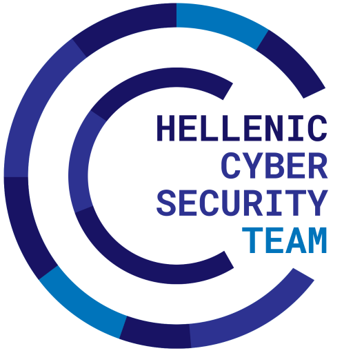

# Πανελλήνιος Μαθητικός Διαγωνισμός Κυβερνοασφάλειας (ΠΜΔΚ) 2024

O 2ος [Πανελλήνιος Μαθητικός Διαγωνισμός Κυβερνοασφάλειας](https://ecsc.gr/index.php/ethical-hacking-comp/) είναι η δεύτερη έκδοση του πανελλαδικού διαδικτυακού Jeopardy-style Capture-The-Flag διαγωνισμού για μαθητές και μαθήτριες της Α΄, Β΄ και Γ΄ Λυκείου όλων των σχολείων της Ελλάδας. Ο διαγωνισμός διοργανώνεται από το [Τμήμα Ψηφιακών Συστημάτων του Πανεπιστημίου Πειραιώς](https://www.ds.unipi.gr) με την υποστήριξη των μελών της [Εθνικής Ομάδας Κυβερνοασφάλειας](https://ecsc.gr).

  
  
  

## Κύριες Δοκιμασίες

|   # | Κατηγορία                     | Δοκιμασία                                                                | Δυσκολία     | Λύσεις | Δημιουργός                                                    |
| --: | :---------------------------- | :----------------------------------------------------------------------- | :----------- | -----: | :------------------------------------------------------------ |
|   1 | Διάφορα                       | [Η Αυθεντική Φωτογραφία](challenge-01-the-original-image/writeup/)       | Μέτρια       | 30     | [Αθανάσιος Γραμματόπουλος](https://github.com/gramthanos)     |
|   2 | Εκμετάλλευση Δυαδικών Αρχείων | [Πέτρα Ψαλίδι Χαρτί](challenge-02-rock-paper-scissors/writeup/)          | Μέτρια       | 10     | [Αθανάσιος Γραμματόπουλος](https://github.com/gramthanos)     |
|   3 | Κρυπτογραφία                  | [Lobotomy Kaisen](challenge-03-lobotomy-kaisen/writeup/)                 | Δύσκολη      | 8      | ApparentlyPlus @ Πανεπιστήμιο Μακεδονίας                      |
|   4 | Κρυπτογραφία                  | [Twisted Algebra](challenge-04-twisted-algebra/writeup/)                 | Πολύ Δύσκολη | 8      | ApparentlyPlus @ Πανεπιστήμιο Μακεδονίας                      |
|   5 | Παγκόσμιος Ιστός              | [Νodelab](challenge-05-nodelab/writeup/)                                 | Μέτρια       | 13     | Γεώργιος Τσιαμούλης (farsight)                                |
|   6 | Αντίστροφη Μηχανική           | [Ransomware v2](challenge-06-ransomware-v2/writeup/)                     | Δύσκολη      | 7      | saspect                                                       |
|   7 | Εκμετάλλευση Δυαδικών Αρχείων | [Horizon Financial](challenge-07-horizon-financial/writeup/)             | Εύκολη       | 13     | [Μιχάλης Τακαρώνης](https://github.com/R3dSh3rl0ck)           |
|   8 | Εκμετάλλευση Δυαδικών Αρχείων | [Hacktrox](challenge-08-hacktrox/writeup/)                               | Εύκολη       | 3      | [Μιχάλης Τακαρώνης](https://github.com/R3dSh3rl0ck)           |
|   9 | Εκμετάλλευση Δυαδικών Αρχείων | [Εφαρμογή πινάκων](challenge-09-array-app/writeup/)                      | Μέτρια       | 4      | [Μιχάλης Τακαρώνης](https://github.com/R3dSh3rl0ck)           |
|  10 | Διάφορα                       | [Top Down](challenge-10-top-down/writeup/)                               | Μέτρια       | 17     | Γιώργος Ρώσσης (Sizon95), Μιχάλης Ευαγγέλου (mikev)           |
|  11 | Κρυπτογραφία                  | [Diffie What The Hellman](challenge-11-diffie-what-the-hellman/writeup/) | Μέτρια       | 6      | [Αλέξανδρος Πάλλης](https://github.com/eid3t1c)               |
|  12 | Κρυπτογραφία                  | [Ecguct](challenge-12-ecguct/writeup/)                                   | Εύκολη       | 29     | [Αλέξανδρος Πάλλης](https://github.com/eid3t1c)               |
|  13 | Κρυπτογραφία                  | [Rout](challenge-13-rout/writeup/)                                       | Δύσκολη      | 4      | [Αλέξανδρος Πάλλης](https://github.com/eid3t1c), [Αριστομένης Τρέσσος](https://github.com/Tressos-Aristomenis) |
|  14 | Κρυπτογραφία                  | [Sloppy Encryptor](challenge-14-sloppy-encryptor/writeup/)               | Μέτρια       | 20     | [Άγγελος Σολωμός](https://github.com/connar)                  |
|  15 | Κρυπτογραφία                  | [Smoll kispeis](challenge-15-smoll-kispeis/writeup/)                     | Εύκολη       | 13     | [Αλέξανδρος Πάλλης](https://github.com/eid3t1c), [Αριστομένης Τρέσσος](https://github.com/Tressos-Aristomenis) |
|  16 | Ψηφιακή Εγκληματολογία        | [Broken Sign](challenge-16-brokensign/writeup/)                          | Εύκολη       | 8      | [Νάσια Κολλάρου](https://github.com/nkollarou)                |
|  17 | Ψηφιακή Εγκληματολογία        | [Showerpell](challenge-17-showerpell/writeup/)                           | Δύσκολη      | 11     | [Νάσια Κολλάρου](https://github.com/nkollarou), [Άγγελος Σολωμός](https://github.com/connar)                   |
|  18 | Ψηφιακή Εγκληματολογία        | [Misleading Secret](challenge-18-misleading-secret/writeup/)             | Εύκολη       | 21     | [Νάσια Κολλάρου](https://github.com/nkollarou)                |
|  19 | Ψηφιακή Εγκληματολογία        | [Upgrading Windows](challenge-19-upgrading-windows/writeup/)             | Εύκολη       | 22     | [Αλέξανδρος Πάλλης](https://github.com/eid3t1c), [Άγγελος Σολωμός](https://github.com/connar)                  |
|  20 | Αντίστροφη Μηχανική           | [Ancient Cave Vault](challenge-20-ancient-cave-vault/writeup/)           | Εύκολη       | 21     | [Άγγελος Σολωμός](https://github.com/connar)                  |
|  21 | Αντίστροφη Μηχανική           | [Rand0mware](challenge-21-rand0mware/writeup/)                           | Πολύ Δύσκολη | 3      | [Αλέξανδρος Πάλλης](https://github.com/eid3t1c)               |
|  22 | Παγκόσμιος Ιστός              | [Search 4](challenge-22-search-4/writeup/)                               | Εύκολη       | 8      | [Αθανάσιος Γραμματόπουλος](https://github.com/gramthanos)     |
|  23 | Παγκόσμιος Ιστός              | [WebCourses](challenge-23-web-courses/writeup/)                          | Εύκολη       | 30     | [Αθανάσιος Γραμματόπουλος](https://github.com/gramthanos)     |
|  24 | Παγκόσμιος Ιστός              | [Client Chest](challenge-24-client-chest/writeup/)                       | Εύκολη       | 30     | [Αθανάσιος Γραμματόπουλος](https://github.com/gramthanos)     |

## Τελικός πίνακας βαθμολογίας

| Θέση | Ομάδα                            | Λύσεις | Πόντοι | 
| ---: | :------------------------------- | -----: | -----: |
| 1    | Λύκειο Κολλεγίου Ψυχικού         | 24     | 9011   |
| 2    | Ε.Κ. Νεάπολης – 1ο ΕΠΑΛ Νεάπολης | 24     | 9011   |
| 3    | Εκπαιδευτήρια Δούκας             | 17     | 4980   |
| 4    | 4o Πειραματικό ΓΕΛ Τρικάλων      | 13     | 4166   |
| 5    | Πρότυπο Λύκειο Αγ. Αναργύρων     | 8      | 3897   |
| 6    | 1ο ΕΠΑΛ Θεσσαλονίκης             | 14     | 3707   |
| 7    | 1ο ΓΕ.Λ. Ηλιούπολης              | 13     | 3391   |
| 8    | Εκπαιδευτήρια Δούκας             | 10     | 2308   |
| 9    | Εκπαιδευτήρια Ε. Μαντουλίδη      | 4      | 2262   |
| 10   | Εκπαιδευτήρια Δούκα              | 9      | 2159   |
| 11   | 1ο ΓΕΛ Ελληνικού                 | 8      | 1559   |
| 12   | Εργαστηριακό Κέντρο (ΕΚ) Ευόσμου | 10     | 1549   |
| 13   | ΕΚ Ευόσμου                       | 9      | 1400   |
| 14   | Γενικό Λύκειο Αρναίας            | 7      | 880    |
| 15   | 2ο Ημερήσιο ΕΠΑ.Λ. Λαμίας        | 4      | 400    |
| 16   | Μουσικό Σχολείο Θερίσου (Χανίων) | 2      | 249    |
| 17   | Λύκειο Κολλεγίου Ψυχικού         | 1      | 100    |
| 18   | 1ο ΕΠΑΛ Δάφνης                   | 1      | 100    |
| 19   | 1ο ΕΠΑΛ Δάφνης                   | 1      | 100    |
| 20   | Μουσικό Σχολείο Θερίσου (Χανίων) | 1      | 100    |

Στον παραπάνω πίνακα δίνεται η τελική κατάταξη των ομάδων με θετική βαθμολογία.
Για την τελική βαθμολογία έγινε ανάλυση των λύσεων (writeups) που παρέδωσαν οι ομάδες και αφαιρέθηκαν πόντοι για κάθε δοκιμασία για την οποία δεν δόθηκε γραπτή λύση.
