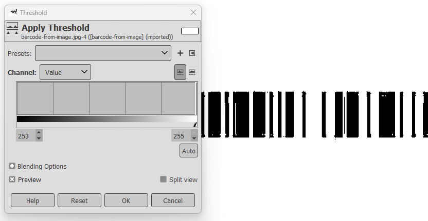
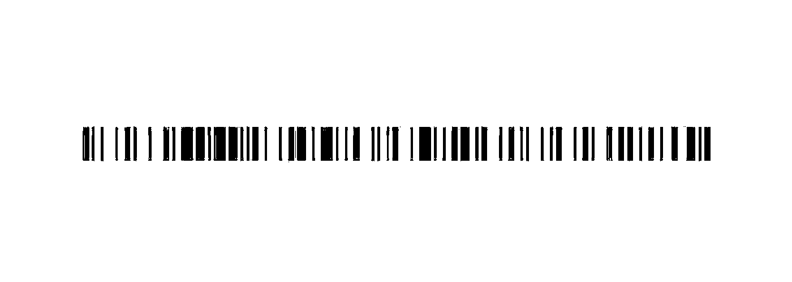
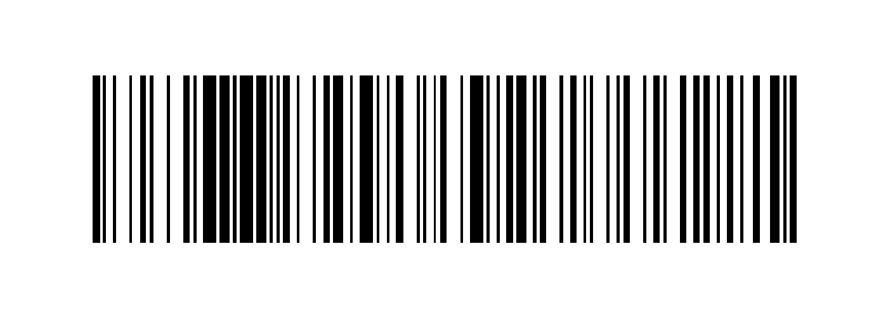
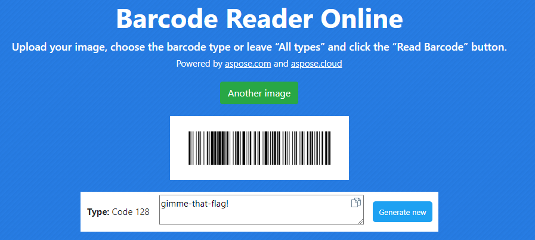
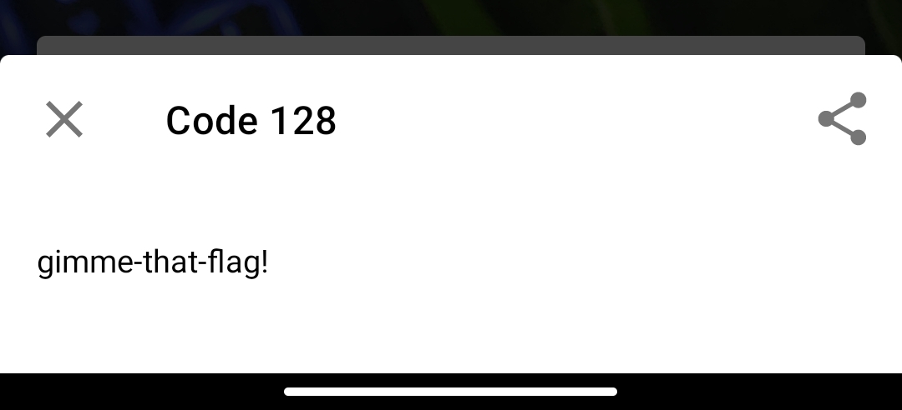

# Η Αυθεντική Φωτογραφία Write-Up

| Δοκιμασία | Η Αυθεντική Φωτογραφία |
| :------- | :----- |
| Δυσκολία | Μέτρια |
| Κατηγορία | Διάφορα (Misc) |
| Λύσεις | 30 |
| Πόντοι | 100 |

## Επισκόπηση Δοκιμασίας

Μας δίνεται μια παραποιημένη φωτογραφία:


Και μας ζητείτε να βρούμε την αυθεντική και να ελέγξουμε τι άλλαξε. Παράλληλα μας δίνεται και ένα zip αρχείο το οποίο για να το ανοίξεις χρειάζεται ένας κωδικός.

## Επίλυση

Μετά από ψάξιμο στα social media, βρήκαμε μια ανάρτηση η οποία περιέχει την αυθεντική φωτογραφία:


Αφού συγκρίναμε την αυθεντική φωτογραφία με την παραποιημένη, είδαμε πως η αυθεντική περιέχει ένα barcode στο κάτω αριστερά μέρος της.

Με την χρήση του δωρεάν εργαλείου [GIMP](https://www.gimp.org/) για την επεξεργασία φωτογραφιών αφαιρέσαμε το barcode από την φωτογραφία:


Στην συνέχεια για την ευκολότερη ανάγνωση του barcode, εφαρμόζοντας ένα όριο (threshold) στην κατάλληλη περιοχή, διαχωρίσαμε τα pixel της εικόνας σε 2 κατηγορίες μετατρέποντάς τα σε λευκά και μαύρα:




Έπειτα, αν και δεν χρειάζεται αν έχουμε μια καλή εφαρμογή για ανάγνωση barcode, καθαρίσαμε το barcode, και το επεκτείναμε στον άξονα των y:




Στην συνέχεια, κάνοντας χρήση μιας εφαρμογής αποκωδικοποίησης barcode (πχ. την εφαρμογή [PDF417 barcode scanner](https://play.google.com/store/apps/details?id=mobi.pdf417) για android, ή με την χρήση κάποιου online εργαλείου σαν το [Barcode Reader Online](https://products.aspose.app/barcode/recognize)), σαρώσαμε το barcode:





και πήραμε το κωδικοποιημένο μήνυμα:
```
gimme-that-flag!
```

Στην συνέχεια, βάλαμε το μήνυμα σαν κωδικό για να αποσυμπιέσουμε το zip αρχείο και πήραμε το flag μέσα από το `flag.txt` αρχείο.

## Σημαία

```
FLAG{acbfffb8ca3b5dc48b1be87d9b7fedbc68d288f34ceb8190d47607c305f30a60}
```
