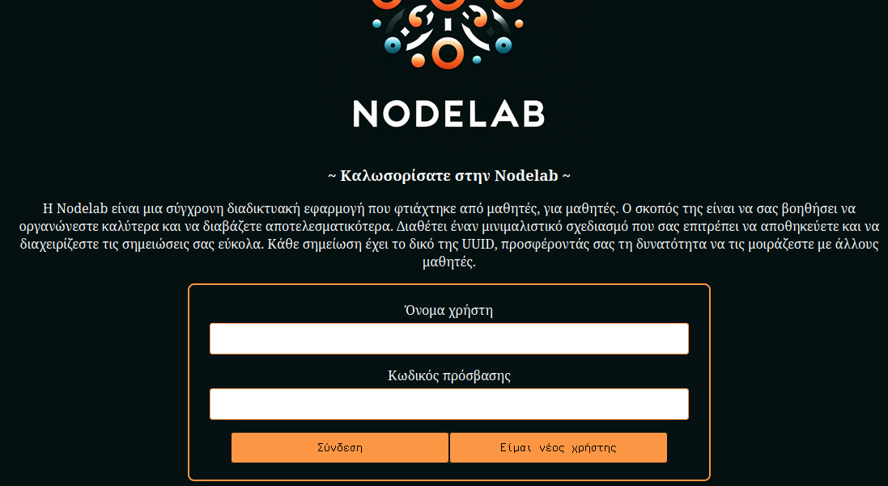
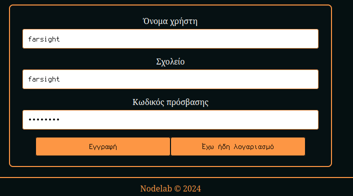
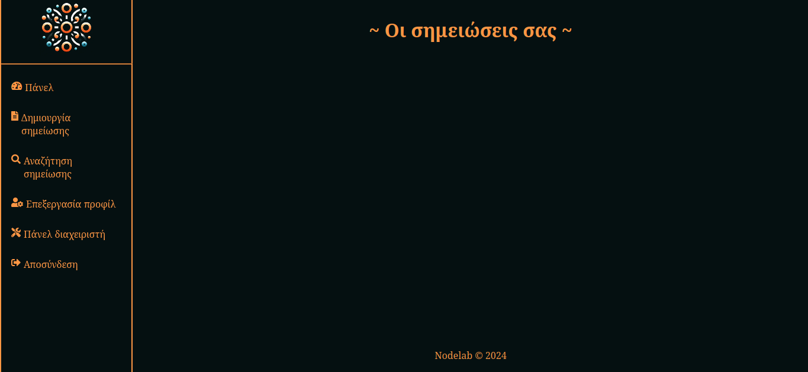
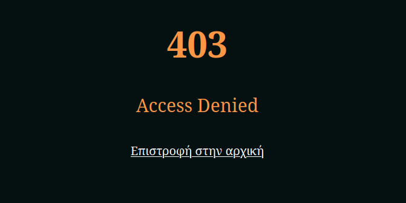
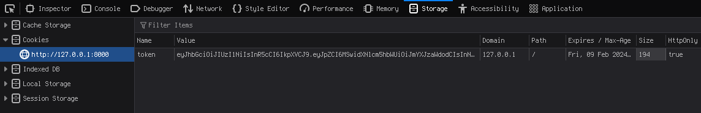
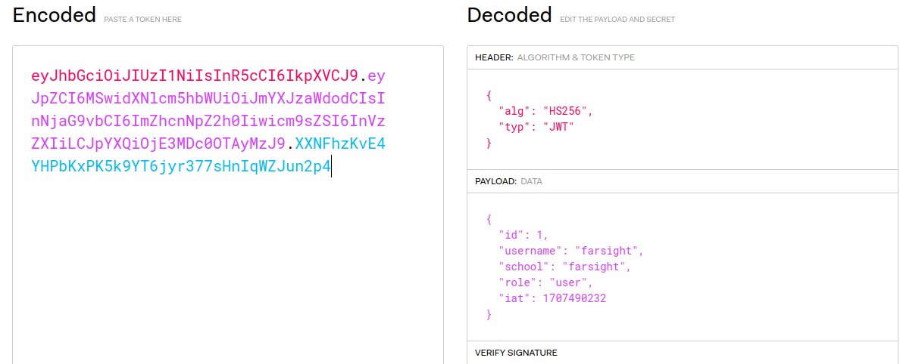
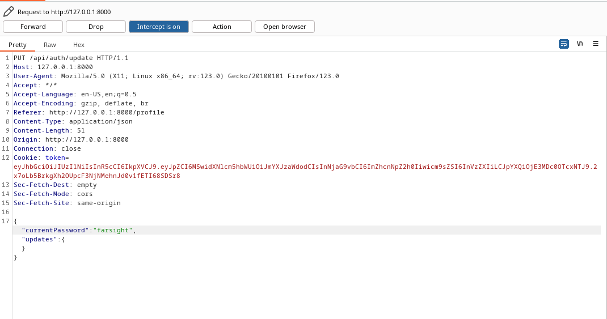
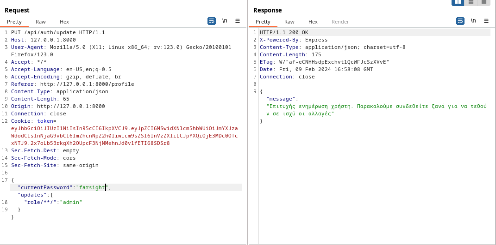
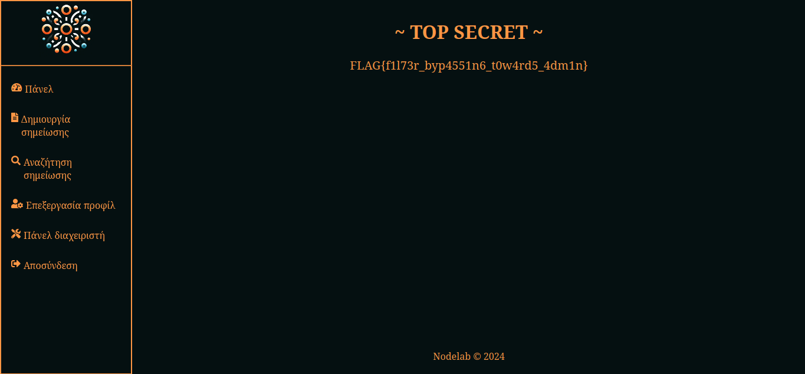

# Nodelab Write-Up

| Δοκιμασία | Nodelab |
| :------- | :----- |
| Δυσκολία | Μέτρια |
| Κατηγορία | Παγκόσμιος Ιστός (Web) |
| Λύσεις | 13 |
| Πόντοι | 420 |

## Επισκόπηση Δοκιμασίας

Στην εκφώνηση της δοκιμασίας μας δίνεται ο σύνδεσμος ενός ιστότοπου και ο κώδικάς του σε ένα αρχείο zip, τον οποίο πρέπει να ελέγξουμε για κενά ασφάλειας.
Ανοίγοντας τον σύνδεσμο σε μια νέα καρτέλα, βλέπουμε την περιγραφή της δικτυακής εφαρμογής και την δυνατότητα να συνδεθούμε ή να δημιουργήσουμε νέο λογαριασμό.



## Επίλυση

### Αρχική ανάλυση ιστότoπου

Εφόσον η εκφώνηση δεν μας δίνει κάποιο συγκεκριμένο λογαριασμό, θα φτιάξουμε έναν δικό μας. Πατώντας `Είμαι νέος χρήστης` εμφανίζεται η φόρμα εγγραφής, και μπορούμε να συμπληρώσουμε τα στοιχεία μας (π.χ. όνομα χρήστη `farsight`, όνομα σχολείου `farsight`, κωδικός πρόσβασης `farsight`)



Πατώντας `Εγγραφή`, εμφανίζεται ένα pop up που μας επιβεβαιώνει ότι η εγγραφή ήταν επιτυχής και μπορούμε πλέον να συνδεθούμε με τα στοιχεία μας και να αποκτήσουμε πρόσβαση στην διαδικτυακή εφαρμογή. Κάνοντας σύνδεση, ανακατευθυνόμαστε στο endpoint `/dashboard`.



Αναλύοντας το `/dashboard`, παρατηρούμε ότι υπάρχει ένα πλαϊνό πάνελ στα αριστερά. Με μια πρώτη ματιά, οι περισσότερες από τις επιλογές (όπως `Δημιουργία σημείωσης`,`Επεξεργασία προφίλ` κτλ), φαίνονται σχετικά απλές, και πατώντας πάνω σε αυτές, μας δίνει πρόσβαση στην κύρια λειτουργεία της εφαρμογής, η οποία είναι η διαχείριση σημειώσεων, και η δυνατότητα αλλαγής των στοιχείων του προφίλ μας. 

Όμως, μια επιλογή που μας κινεί το ενδιαφέρον είναι το `Πάνελ διαχειριστή`. Πατώντας αυτή την επιλογή, ανακατευθυνόμαστε στο endpoint /administration, όπου βλέπουμε το εξής.



Συνεπώς, καταλαβαίνουμε ότι ο web server μας εμποδίζει την πρόσβαση στο συγκεκριμένο endpoint. Για να κατανοήσουμε τον λόγο καλύτερα, πρέπει να αναλύσουμε τον κώδικά της.

### Αρχική ανάλυση κώδικα

Ανοίγοντας τον φάκελο `/app`, βλέπουμε τα εξής αρχεία και υποφακέλους:
1. `/routes` : Αυτός ο φάκελος περιέχει αρχεία που καθορίζουν τις διαδρομές (routes) της εφαρμογής. Οι διαδρομές αντιστοιχούν σε διαφορετικά endpoints του web server και καθορίζουν πώς θα αντιδράσει σε διάφορα HTTP requests (π.χ., GET, POST). Στην δικιά μας περίπτωση, περιέχει τα αρχεία `index.js` που αφορά τα κύρια endpoints του ιστότοπου και `api.js` που αφορά τα endpoints του api.
2. `/utils`: Σε αυτόν τον φάκελο συνήθως βρίσκονται βοηθητικά αρχεία ή μονάδες λογισμικού (utilities) που είναι επαναχρησιμοποιήσιμα σε διάφορα μέρη της δικτυακής εφαρμογής. Στην δικιά μας περίπτωση περιέχει τα αρχεία `database.js` και `authorization.js`.
3. `/static` : Αυτός ο φάκελος περιέχει στατικά αρχεία που χρησιμοποιεί η δικτυακή εφαρμογή, όπως εικόνες, CSS αρχεία και JavaScript αρχεία για το frontend. Αυτά τα αρχεία δεν αλλάζουν και στέλνονται "ως έχουν" στο client.
4. `/views` : Αυτός ο φάκελος περιέχει αρχεία που καθορίζουν την παρουσίαση της εφαρμογής, χρησιμοποιώντας κάποιο σύστημα template system (στην δικιά μας περίπτωση χρησιμοποιεί Pug). Τα αρχεία αυτά καθορίζουν το HTML που θα παραχθεί δυναμικά βάσει των δεδομένων που παρέχει η δικτυακή εφαρμογή.
5. `package.json` : Αυτό το αρχείο, περιέχει πληροφορίες σχετικά με την δικτυακή εφαρμογή, όπως το όνομα, την έκδοση, την περιγραφή, τον συγγραφέα και τα dependencies που χρειάζεται η εφαρμογή για να τρέξει (μπορεί να έχει και άλλες πληροφορίες ή λειτουργίες που δεν αναφέρονται εδώ).
6. `server.js` : Τέλος, αυτό είναι το κύριο αρχείο της δικτυακής εφαρμογής που περιέχει τον κώδικα για την εκκίνηση του web server.

Ας δούμε το αρχείο `/routes/index.js` για να καταλάβουμε το authorization process για το `/administration` endpoint.
```javascript
#!/usr/bin/env node
const fs = require('fs');
const path = require('path');
const express = require('express');
const jwt = require('jsonwebtoken');
const router = express.Router();
const { getSession, isAdminSession } = require('../utils/authorization.js');

// Load flag
const flag = (function (flag_path) {
    // Load flag from file
    if (fs.existsSync(flag_path)) {
        return fs.readFileSync(flag_path, 'utf8').trim();
    }
    // Load Test Flag
    return 'FLAG{example-flag-for-testing}';
})(path.join(__dirname, '..', 'flag.txt'));

<SNIP>

// Admin Page
router.get('/administration', (req, res) => {
    const sess = getSession(req);
    if (!sess) {
        return res.redirect('/');
    }

    try {
        if (isAdminSession(sess)) {
            return res.render('admin', { title: 'Nodelab ~ Admin', flag: flag });
        }
        else {
            return res.status(403).render('error', {error_code: '403', error_message: 'Access Denied'});
        }
    }
    catch (e) {
        return res.status(500);
    }

});

module.exports = router;
```
Βλέπουμε ότι στην μεταβλητή `flag` αποθηκεύεται το περιεχόμενο του αρχείου `../flag.txt`, και εάν δεν υπάρχει το αρχείο, αποθηκεύεται ένα fake flag. Επιπλέον, στο endpoint `/administration`, χρησιμοποιούνται τα functions `getSession()` και `isAdminSession()` (που βρίσκονται στο `/utils/authorization.js` αρχείο) για να κρίνει εάν το session είναι του διαχειριστή. Εάν το session είναι του διαχειριστή, τότε φορτώνει το admin pug template και του δείχνει το `flag`. Ας δούμε πως λειτουργούν τα δύο functions που χρησιμοποιούνται.

`/utils/authorization.js`
```javascript
#!/usr/bin/env node
const authSecret = require('crypto').randomBytes(64).toString('hex');
const jwt = require('jsonwebtoken');

const signToken = (payload) => {
	return jwt.sign(payload, authSecret);
};

const verifyToken = (token) => {
	try {
		return jwt.verify(token, authSecret);
	}
	catch (e) {
		return null;
	}
};

const getSession = (req) => {
    const token = req.cookies.token;
    const jwt = verifyToken(token);
    return jwt;
};

const isAdminSession = (sess) => {
	if (sess && sess.role === 'admin') {
		return true;
	}
	return false;
};


module.exports = {
	getSession,
	signToken,
	verifyToken,
	isAdminSession
};
```
Βλέπουμε ότι για το `getSession()` function, η εφαρμογή διαβάζει το cookie από το HTTP request, που είναι ένα JWT (json web token), και το κάνει verify με την χρήση ενός μυστικού κλειδιού (που είναι η μεταβλητή `authSecret`), ώστε να ελέγξει ότι είναι έγκυρο και δεν έχει τροποποιηθεί. Εάν είναι έγκυρο επιστρέφει το decoded jwt, και εάν δεν είναι έγκυρο επιστρέφει null.

Όσον αφορά το `isAdminSession()` function, η εφαρμογή διαβάζει το session (μεταβλητή `sess`) που του δίνεται, και εάν υπάρχει (δεν είναι null ή undefined) και η ιδιότητα `role` ισούται με το string admin, τότε επιστρέφει true. Αλλιώς επιστρέφει false.

Ας δούμε λοιπόν το δικό μας JWT (πατώντας δεξί κλικ στον ιστότοπο -> Inspect -> Storage), και τί ιδιότητες έχει, χρησιμοποιώντας την ιστοσελίδα https://jwt.io



Παρατηρούμε ότι το δικό μας `role` ισούται με την τιμή user. Επίσης βλέπουμε και άλλες τιμές που βάλαμε κατά την εγγραφή (όπως `username` και `school`), άρα η τιμή για το `role`, αποθηκεύεται λογικά σε κάποια βάση δεδομένων μαζί με τις υπόλοιπες τιμές. 
Συνεπώς, είναι φανερό πλέον ότι, για να λύσουμε το challenge και να πάρουμε το flag, πρέπει να αποκτήσουμε πρόσβαση ή να φτιάξουμε έναν user όπου η τιμή για το `role` του ισούται με admin.

### Κυρίως επίλυση

Ας ανοίξουμε το αρχείο `/routes/api.js` και `/utils/database.js`, για να δούμε πως λειτουργεί η διαδικασία εγγραφής:

`/routes/api.js`
```javascript
#!/usr/bin/env node

const express = require('express');
const router = express.Router();
const { getSession, signToken, verifyToken } = require('../utils/authorization.js');

<SNIP>

// User Registration
router.post('/auth/register', async (req, res) => {
	try {
		const { username, school, password } = req.body;
		if (!username || !school || !password) {
			return res.status(401).json({ error: 'Παρακαλώ συμπληρώστε όλα τα απαραίτητα πεδία' });
		}
		else if (username.length > 20 || school.length > 20) {
			return res.status(401).json({ error: 'Το όνομα χρήστη ή το όνομα σχολείου δεν μπορεί να υπερβαίνει τους 20 χαρακτήρες' });
		}
		else if (password.length < 6) {
			return res.status(401).json({ error: 'Το μήκος του κωδικού πρόσβασης πρέπει να είναι τουλάχιστον 6 χαρακτήρες'});
		}
		await req.db.registerUser(username, school, password, 'user');
		return res.status(200).json({ message: 'Ο χρήστης εγγράφηκε με επιτυχία' });
	}
	catch (e) {
		if (error_messages.includes(e.message)) {
			return res.status(409).json({ error: e.message });
		}
		else {
			return res.status(500).json({ error: 'Εσωτερικό σφάλμα διακομιστή' });
		}
	}
});

<SNIP>
```
`/utils/database.js`
```javascript
#!/usr/bin/env node

const sqlite3 = require('sqlite3');
const { open } = require('sqlite');
const bcrypt = require('bcrypt');
const { v4: uuidv4 } = require('uuid');

class Database {
	
	<SNIP>

	async registerUser(username, school, password, role) {
		if (await this.isUsernameTaken(username)) {
			throw new Error('Το όνομα χρήστη έχει ήδη ληφθεί');
		}

		const hashedPassword = await bcrypt.hash(password, 10);
		let stmt = await this.db.prepare('INSERT INTO users (username, school, password, role) VALUES (?, ?, ?, ?)');
		return await stmt.run(username, school, hashedPassword, role);
	}

	<SNIP>
```
Παρατηρούμε ότι η εφαρμογή, στο `/api/auth/register` endpoint, παίρνει τις μεταβλητές `username`, `school`, `password` μαζί με τις αντίστοιχες τιμές από το HTTP request json body, και μέτα από κάποιον έλεγχο τις καταχωρεί στην βάση δεδομένων μαζί με την τιμή `user` (για την μεταβλητή `role`) που είναι hardcoded στον κώδικα. Επομένως, δεν υπάρχει τρόπος να την μεταβάλουμε κατά την εγγραφή μας, και δεν υπάρχει τρόπος για SQL Injection, καθώς χρησιμοποιεί τα ερωτηματικά ( (?, ?, ?, ?) ) ως placeholders για τις τιμές που του δίνονται. Δηλαδή, υπάρχει σωστό sanitizing, και οι τιμές που του δίνονται αντιμετωπίζονται ως data text και όχι ως executable code.

Στα ίδια αρχεία όμως, υπάρχει και ο παρακάτω κώδικας:

`/routes/api.js`
```javascript
<SNIP>

// Update User Information
router.put('/auth/update', async (req, res) => {
	try {
		const sess = getSession(req);
		const { currentPassword, updates } = req.body;
		if (!sess) {
			return res.status(401).json({ error: 'Μη εξουσιοδοτημένη ενέργεια' })
		}

		if ((updates.username && updates.username.length > 20) || (updates.school && updates.school.length > 20)) {
			return res.status(401).json({ error: 'Το όνομα χρήστη ή το όνομα σχολείου δεν μπορεί να υπερβαίνει τους 20 χαρακτήρες' });
		}
		else if (updates.password && updates.password.length < 6) {
			return res.status(401).json({ error: 'Το μήκος του κωδικού πρόσβασης πρέπει να είναι τουλάχιστον 6 χαρακτήρες'});
		}
		
		await req.db.updateUser(sess.id, currentPassword, updates);
		return res.status(200).json({ message: 'Επιτυχής ενημέρωση χρήστη. Παρακαλούμε συνδεθείτε ξανά για να τεθούν σε ισχύ οι αλλαγές'});
	}
	catch (e) {
		if (error_messages.includes(e.message)) {
			return res.status(401).json({ error: e.message }); 
		}
		else {
			return res.status(500).json({ error: 'Εσωτερικό σφάλμα διακομιστή' });
		}
	}
});

<SNIP>
```
`/utils/database.js`
```javascript
<SNIP>

async updateUser(id, currentPassword, updates) {
	let fields = [];
	let values = [];
	let userPassword = await this.getUserPassword(id);
		
	if (!(await bcrypt.compare(currentPassword, userPassword.password))) {
		throw new Error('Δόθηκε λάθος κωδικός πρόσβασης');
	}

	for (const [key, value] of Object.entries(updates)) {
		if (key.toLowerCase() === 'username' && (await this.isUsernameTaken(value))) {
			throw new Error('Το όνομα χρήστη έχει ήδη ληφθεί');
		}
		else if (key.toLowerCase() === 'password' && value) {
			fields.push(`${key} = ?`);
			values.push(await bcrypt.hash(value, 10));
		}
		else if (key.toLowerCase() === 'role') {
			throw new Error('Εντοπίστηκε κακόβουλη ενέργεια');
		}
		else {
			fields.push(`${key} = ?`);
			values.push(value);
		}
	}

	if (fields.length === 0) {
		throw new Error('Δεν δόθηκαν έγκυρα πεδία για ενημέρωση');
	}

	const query = `UPDATE users SET ${fields.join(', ')} WHERE id = ?`;
	values.push(id);
	let stmt = await this.db.prepare(query);
	return await stmt.run(values);
}

<SNIP>
```
Συνοπτικά, στο `/api/auth/update` endpoint, ο χρήστης μπορεί να στείλει ένα json object, τα `fields` που θέλει να κάνει update μαζί με τα αντίστοιχα `values`. Μετέπειτα, το `updateUser()` function, χτίζει δυναμικά το SQL query, προσθέτοντας κάθε `key-value pair` που του έχει δοθεί. Παρόλα αυτά, αν προσπαθήσουμε να του δώσουμε ως πεδίο `role` και ως τιμή `admin`, θα το εμποδίσει γυρνώντας το error `Εντοπίστηκε κακόβουλη ενέργεια`.

Όμως, η μεταβλητή `key`, δεν γίνεται sanitized πριν προστεθεί στο query, κάνοντας το ευάλωτο σε SQL Injection. Μπορούμε να εκμεταλλευτούμε αυτή την ευπάθεια, για να κάνουμε bypass το φίλτρο που ελέγχει εάν το `key` ισούται με την τιμή `role`, δίνοντας για το `key` την τιμή `role/**/`. Με αυτό τον τρόπο θα προσπεράσουμε τον έλεγχο (καθώς 'role' !=  'role/\*\*/') αλλά και όταν εκτελεστεί το query, θα αντιμετωπίσει τους χαρακτήρες '/\*\*/' ως multi-line comment και όχι ως κομμάτι του text, καθώς στην γλώσσα SQL, οι συγκεκριμένοι χαρακτήρες χρησιμοποιούνται για multi-line comment.

Για το exploitation process, μπορούμε να χρησιμοποιήσουμε το εργαλείο Burp Suite, για να κάνουμε intercept το HTTP request που θα στείλουμε προς το `/api/auth/update` για να τροποποιήσουμε τα απαραίτητα πεδία. 

Με το Intercept να είναι στο off, διαλέγουμε την επιλογή `Επεξεργασία προφίλ` στο πλαϊνό πάνελ, βάζουμε το τρέχων κωδικό πρόσβασης στο κατάλληλο πεδίο, ενεργοποιούμε το Intercept, και πατάμε το κουμπί `Υποβολή`. Επιστρέφοντας στο Burp Suite, παρατηρούμε ότι έπιασε το παρακάτω HTTP request.



Πατώντας δεξί κλικ πάνω στο HTTP request διαλέγουμε την επιλογή `Send to Repeater`. Από το παράθυρο `Repeater`, μπορούμε να κάνουμε ότι μετατροπή θέλουμε και να την στείλουμε στο web server.



Κάνοντας την απαραίτητη μετατροπή για το exploitation, πατάμε `Send` και λαμβάνουμε το μήνυμα ότι η ενημέρωση στοιχείων ήταν επιτυχής και ότι πρέπει να ξανασυνδεθούμε για να τεθούν σε ισχύ οι αλλαγές. Το μόνο που μένει πλέον είναι να κάνουμε αποσύνδεση, να ξανακάνουμε σύνδεση ώστε να δημιουργηθεί καινούργιο session, και να επισκεφτούμε το `/administration` endpoint.



## Σημαία

```
FLAG{f1l73r_byp4551n6_t0w4rd5_4dm1n}
```