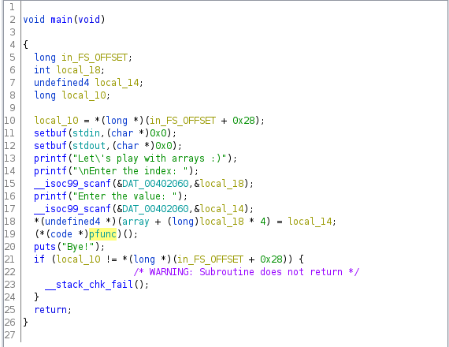
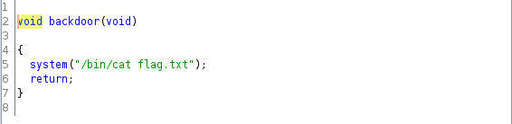
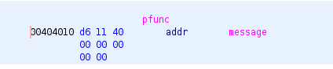

# Εφαρμογή πινάκων

| Δοκιμασία | 	Εφαρμογή πινάκων |
| :------- | :----- |
| Δυσκολία | Μέτρια |
| Κατηγορία | Pwn |
| Λύσεις | 4 |
| Πόντοι | 589 |

### Επισκόπηση Δοκιμασίας

Μια εφαρμογή για προσθήκη τιμών σε πίνακες, πόσο άσχημε μπορεί να πάει..

Το πρόγραμμα μας ζητάει το input μας για να δώσουμε τη θέση μνήμης που θέλουμε να αποθηκευτεί καθώς και την τιμή και τερματίζει.


```
Let's play with arrays :)
Enter the index: 1
Enter the value: 2
Thank you for using our app.
Bye!
```

# Επίλυση Δοκιμασίας

### Έλεγχος του αρχείου 

Αρχικά αφού δούμε τη λειτουργία του binary βλέπουμε λεπτομέρειες για το executable με την εντολή `file`.

```bash
file binary 
binary: ELF 64-bit LSB executable, x86-64, version 1 (SYSV), dynamically linked, interpreter /lib64/ld-linux-x86-64.so.2, BuildID[sha1]=30bcccf7585add0ef43018124a0e21383a769250, for GNU/Linux 3.2.0, not stripped
```
- Dynamically linked 
  - Όταν ένα εκτελέσιμο πρόγραμμα είναι "dynamically linked" (δυναμικά συνδεδεμένο), αυτό σημαίνει ότι χρησιμοποιεί δυναμική σύνδεση με βιβλιοθήκες κατά την εκτέλεσή του. Αντί να ενσωματώνει όλο τον κώδικα των βιβλιοθηκών που χρησιμοποιεί απευθείας στο εκτελέσιμό του, το πρόγραμμα δεσμεύει δυναμικά τις βιβλιοθήκες αυτές κατά την εκτέλεση.   
- not stripped
  - Όταν το εκτελέσιμο πρόγραμμα είναι "not stripped" ουσιαστικά δεν αφαιρεί την πληροφορία από τον κώδικά του. Αυτή η πληροφορία περιλαμβάνει συνήθως συμβολικά ονόματα, σύμβολα, και άλλες πληροφορίες που χρησιμοποιούνται κατά την ανάπτυξη και την αποσφαλμάτωση του κώδικα

Έπειτα ελέγχουμε τα security mitigations. Αυτά που μας ενδιαφέρουν για το συγκεκριμένο είναι το canary και το pie τα οποία είναι disabled.

```bash
checksec --file binary 
[*] './binary'
    Arch:     amd64-64-little
    RELRO:    Full RELRO
    Stack:    Canary found
    NX:       NX enabled
    PIE:      No PIE (0x400000)

```
- No pie
  - Αυτό σημαίνει ότι το αρχείο θα φορτώνεται κάθε φορά στις ίδιες διεύθυνση μνήμης, αυτό σημαίνει ότι πάντα ξέρουμε που θα βρίσκονται οι συναρτήσεις του εκτελέσιμου προγράμματος.

### Στατική ανάλυση του κώδικα σε decomplier (ghidra)

Από την στατική ανάλυση του κώδικα βλέπουμε ότι δεν υπάρχει κάποιος έλεγχος σε πιο σημείο μπορούμε να γράψουμε στη μνήμη, οπότε έχουμε την δυνατότητα να πανωγράψουμε μια θέση μνήμης καθώς και να τις δώσουμε τιμή και του επόμενου input που είναι η ανάθεση τιμής.




Μια ενδιαφέρουσα συνάρτηση είναι η win όπου μας εμφανίζει τη σημαία, και αφού δεν έχουμε pie ξέρουμε πάντα την τιμή της θέσης μνήμης της όταν τρέχει το πρόγραμμα.



Συνοψίζοντας, πρέπει να βρούμε το padding μέχρι να φτάσουμε στον program counter και να του δώσουμε την επιθυμητή τιμή (τη θέση μνήμης της συνάρτησης backdoor).

Μια άλλη ενδιαφέρουσα συνάρτηση είναι η pfunc που είναι ένας function pointer που μετά το κλικ βλέπουμε οτί κρατάει τη θέση μνήμης της συνάρτησης `message`. Επιπλέον βρίσκεται στο `.data` section αυτό σημαίνει ότι είναι global και αρχικοποιείται. Το σχέδιο είναι να αλλάξουμε την τιμή της `message` με αυτή της `win`, γιατί κάθε φορά που τελειώνει το πρόγραμμα με τη χρήση του fucntion pointer καλείται η `message`.



Έπειτα αν κλικάρουμε στον `array` θα δούμε ότι βρίσκεται στο `.bss` section, άρα είναι global χώρις αρχικοποιημένες τιμές.

.

Αφαιρώντας λοιπόν την τιμή της θέσης μνήμης του `array (0x00404040)` με αυτή του `pfunc (0x00404010)` βρίσκουμε την απόσταση μεταξύ των 2 που είναι (0x30 = 48) αφού είμαστε σε επίπεδο intergers η κάθε θέση του πίνακα θα λαμβάνει 4 bytes μνήμη. Διαιρώντας λοιπόν με το 4 βρίσκουμε το offset να είναι 12. Οπότε αν δώσουμε σαν index τον αριθμό -12 (γιατί είναι πιο πίσω στη μνήμη ο `pfunc`) θα έχουμε την δυνατότητα να γράφουμε πάνω σε αυτόν και με τη χρήση του επόμενου input μπορούμε να θέσουμε την τιμή της `win!` (σε δεκαδική μορφή)

Για να το δοκιμάσουμε.

```
Let's play with arrays :)
Enter the index: -12
Enter the value: 4198896
FLAG{3xpl01t1ng_Out_0f_B0unds_L34ds_t0_Un3xp3ct3d_4dv3ntur3s}
Bye!
```
# Σημαία

`FLAG{3xpl01t1ng_Out_0f_B0unds_L34ds_t0_Un3xp3ct3d_4dv3ntur3s}`


