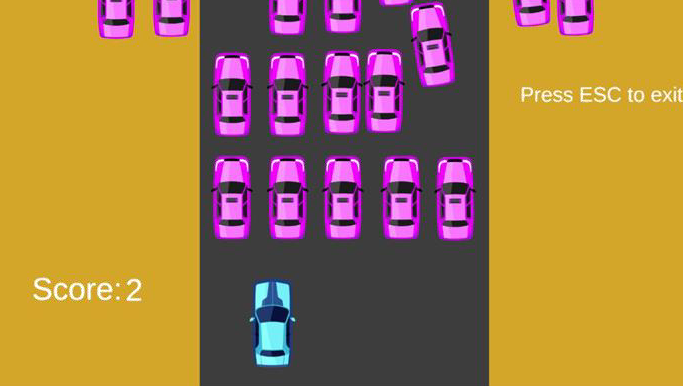

#  topDown Write-Up

| Δοκιμασία |  topDown |
| :------- | :----- |
| Δυσκολία | Μέτρια |
| Κατηγορία |  Αντίστροφη Μηχανική / Παιχνίδια
| Λύσεις | 17 |
| Πόντοι | 280 |

## Περιγραφή Δοκιμασίας

``` 
Χθες, γύρισα σπίτι και βρήκα ένα σημείωμα από τον αδερφό μου το οποίο έλεγε: 

“Καλημέρα αδερφή, πάντα δεν λες πως είσαι καλύτερη από εμένα στα παιχνίδια; Χα... ούτε καν, ό,τι κι αν κάνεις, δεν θα μπορέσεις ποτέ να με νικήσεις σε αυτό το παιχνίδι...”.

Βοήθησέ με να του αποδείξω ότι έχει άδικο!!
```


### Attachment

 `chall_topDown.zip`

## Επίλυση


Αφού κατεβάσουμε το zip του παιχνιδιού και το κάνουμε extract, βλέπουμε την παρακάτω δομή:


Πολύ γρήγορα καταλαβαίνουμε ότι πρόκειται για Unity Game.

Αρχικά, δοκιμάζουμε να παίξουμε κανονικά το παιχνίδι, το οποίο πρόκειται για ένα generic racing game που πρέπει να μαζεύεις νομίσματα και να αποφεύγεις τα άλλα οχήματα.

Σύντομα όμως, καταλαβαίνουμε ότι το παιχνίδι είναι unbeatable, καθώς ύστερα από κάποιο διάστημα μια μεγάλη συστοιχία αμαξιών εμφανίζονται στην οθόνη, που είναι αδύνατον να προσπεράσουμε:



Άρα πρέπει να βρούμε έναν τρόπο να χακάρουμε το παιχνίδι.

Όταν αντιμετωπίζουμε ένα Unity Game, πρέπει να γνωρίζουμε ότι το αρχείο που περιλαμβάνει τον κώδικα της εφαρμογής (σε εκτελέσιμη μορφή) ονομάζεται συνήθως Assembly-CSharp.dll (ή GameAssembly.dll)

Υπάρχει πάντα το ενδεχόμενο ο προγραμματιστής να θέλει να προστατεύσει τον κώδικα του προγράμματός τους, δυσκολεύοντας το reverse engineering, οπότε σε αυτήν την περίπτωση χρησιμοποιεί το εργαλείο il2cpp, το οποίο μετατρέπει τον .NET κώδικα (IL) σε κώδικα c++, ώστε να δημιουργήσει ένα native binary, το οποίο γίνεται reverse πολύ πιο δύσκολα (χρησιμοποιεί την κλασική x86 αρχιτεκτονική) και απαιτεί εργαλεία όπως (IDA, Ghidra, il2cppdumper κτλ).

Ευτυχώς στην περίπτωσή μας το Assembly-CSharp.dll (Path: topDown\topDown_Data\Managed ) και αναγνωρίζεται ως .NET Assembly (π.χ. μέσω της IDA)


Αυτό κάνει τη ζωή μας πολύ πιο εύκολη, καθώς μπορούμε να χρησιμοποιήσουμε ένα πολύ δυνατό εργαλείο, το DnSpy για να δούμε τον κώδικα του προγράμματος. Το πλεονέκτημα που έχουμε εδώ είναι ότι το DnSpy:

1. Πραγματοποιεί decompilation πολύ κοντά στον αρχικό κώδικα
2. Επιτρέπει patching του προγράμματος ώστε να μπορούμε να αλλάξουμε τη λειτουργία του.

Φορτώνουμε το αρχείο Assembly-CSharp.dll στο DnSpy μέσω του μενού File → Open...
Κάνουμε expand τα μενού και παίρνουμε την παρακάτω εικόνα:


Εξετάζοντας τα διάφορα scripts, βλέπουμε ότι στο gameHandler υλοποιείται η λειτουργικότητα για τη σύγκρουση του αυτοκινήτου μας (μπλε) με τα μωβ αυτοκίνητα:


Το παραπάνω μας λέει ότι κάθε φορά που δύο οχήματα συγκρούονται το σκορ μας μηδενίζεται και το παιχνίδι γίνεται reset (το CompareTag χρησιμεύει σαν έλεγχος ότι το αμάξι μας συγκρούστηκε με ένα άλλο αμάξι).

Μπορούμε να κάνουμε το αμάξι μας άτρωτο αφαιρώντας τον έλεγο του collision (δεξί κλικ → Edit Method…):


Τώρα η σύγκρουση δε θα επηρεάζει το όχημά μας. Εξετάζοντας και άλλο τον κώδικα διαπιστώνουμε την ύπαρξη ενός finish αντικειμένου, το οποίο όταν γίνει trigger (λογικά όταν φτάσει το αμάξι μας σε αυτό), η σκηνή θα αλλάξει στη σκηνή του flag. Ενδιαφέρον:


Πατάμε αποθήκευση και ξανατρέχουμε το παιχνίδι:


Πράγματι, υπάρχει finish line, το οποίο διασχίζουμε καιιιι…


Μάλιστα, άρα μάλλον πρέπει να πετύχουμε και νέο highscore για να πάρουμε το flag. Ας επιστρέψουμε στον κώδικα.

Υπάρχει ένα script που λέγεται flagScreen. Ίσως εκεί να υπάρχουν κάποιες πληροφορίες.

Πράγματι, ας δούμε λίγο τη συνάρτηση Update:


Η συνάρτηση φαίνεται να ελέγχει αν το τελικό σκορ μας είναι πάνω από 10000 και μόνο τότε ενεργοποιεί το flag. 

Αλλιώς ενεργοποιείται το κείμενο που αναφέρει την απαίτηση για το highscore Δεδομένου ότι κάθε νόμισμα μας δίνει 1 πόντο, αυτό είναι αδύνατο να το πετύχουμε κανονικά. Όμως, μπορούμε να αλλάξουμε τον έλεγχο για το score από 10000 σε 0


Τώρα ό,τι και να γίνει, θα περάσουμε τον έλεγχο. Αποθηκεύουμε και ξανατρέχουμε:


Πράγματι ύστερα από αυτήν την αλλαγή, διασχίζοντας το finish line, πέρα από το τρόπαιο παίρνουμε και το flag!

## Σημαία

```
FLAG{PRO_RACER_OR_HACKER?}
```
