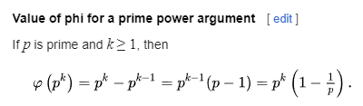

# rout Write-Up

| Δοκιμασία | rout |
| :------- | :----- |
| Δυσκολία | Δύσκολη |
| Κατηγορία | Κρυπτογραφία (Cryptography) / Προγραμματισμός (Programming) |
| Λύσεις | 4 |
| Πόντοι | 589 |


## Περιγραφή Δοκιμασίας

``` 
ERSA, Euler Rivest Shamir Adleman
```

### Source Code

```py
from secret import p, FLAG
from Crypto.Util.number import bytes_to_long

assert (1344204355 * p ** 2 + 2293708968 * p + 2874229898) % 1094526398891 == 310040297343

n = p**1337
e = 0x10001
m = bytes_to_long(FLAG)
c = pow(m, e, n)

with open('output.txt', 'w') as f:
    f.write(f'e = 0x{e:x}\n')
    f.write(f'c = 0x{c:x}\n')
```

### Output Data

 `output.txt` με το public exponent και το κρυπτογραφημένο flag.

## Επίλυση
### Με μια πρώτη ματιά

Από τον κώδικα παρατηρούμε ότι πρόκειται για κρυπτογράφηση RSA.

Μας δίνεται ότι το modulo `N` αποτελείται από τον prime `p` υψωμένο στην δύναμη 1337.
Το `flag` κρυπτογραφείται με το δημόσιο exponent `e` και το modulo `N`.

Ακόμα μας δίνεται ότι ο prime `p` ικανοποιεί την παρακάτω σχέση:

```py
(1344204355 * p ** 2 + 2293708968 * p + 2874229898) % 1094526398891 == 310040297343
```

### Ανάλυση - Εύρεση ευπάθειας - Exploitation

Η σχέση που ικανοποιεί η μεταβλητή `p` είναι του τύπου $a \cdot x^2 + b \cdot x + c = 310040297343$

Επομένως, μιλάμε για μια δευτεροβάθμια εξίσωση από τις ρίζες της οποίας μπορούμε να ανακτήσουμε το `p`. 

Ωστόσο, υπολογίζοντας απλά την διακρίνουσα και μετέπειτα τις ρίζες δεν θα μας δώσει το `p`. Αυτό είναι αποτέλεσμα του ότι η σχέση ικανοποιείται `mod 1094526398891`. 

Για τον λόγο αυτό θα πρέπει να λύσουμε της εξίσωση στον `δακτύλιο 1094526398891`. Με την βοήθεια της sage math μπορούμε να ορίσουμε την σχέση `mod 1094526398891` και να λύσουμε την εξίσωση.

Έχοντας το `p` μπορούμε πολύ εύκολα να υπολογίσουμε το `phi` του `N`.

Όταν το modulo είναι το γινόμενο δύο πρώτων αριθμών `p` , `q` τότε η συνάρτηση του euler `phi`
υπολογίζεται ως εξής:

phi = (p-1) * (q-1)

Ωστόσο στο challenge αυτό το `N = p ^ 1337`

Οπότε θα χρησιμοποιήσουμε τον τύπο του euler για αυτή την περίπτωση phi ===  p<sup>k-1</sup> * (p-1)



Μπορούμε επίσης να χρησιμοποιήσουμε την συνάρτηση της sage `euler_phi()`                  

Στην συνέχεια γνωρίζοντας το phi μπορούμε να υπολογίσουμε το ιδιωτικό κλειδί `d`.

`d` = e<sup>-1</sup> % phi

Στην συνέχει αποκρυπτογραφούμε το κρυπτογραφημένο `flag`.


### Solver


```sage
from Crypto.Util.number import long_to_bytes

with open('output.txt') as f:
    e = eval(f.readline().split(' = ')[1])
    c = eval(f.readline().split(' = ')[1])

R.<x> = PolynomialRing(GF(1094526398891))

F = 1344204355*x**2 + 2293708968*x + 2874229898 - 310040297343

p = int(F.roots()[0][0])

n = p**1337
phi = euler_phi(n)
d = pow(e, -1, phi)
m = pow(c, d, n)
print(long_to_bytes(m))

```

## Σημαία

```
FLAG{s0lv1ng_qu4dr4t1c_3qu4t10n5_l1k3_3ul3r}
```
