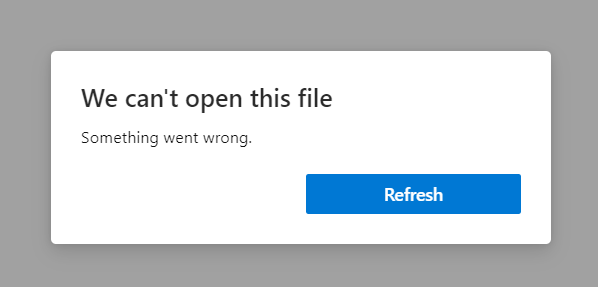

# BrokenSign Write-Up


| Δοκιμασία | brokenSign |
| :------- | :----- |
| Δυσκολία | Εύκολη |
| Κατηγορία |  Forensics |
| Λύσεις | 8 |
| Πόντοι | 539 |


## Περιγραφή Δοκιμασίας
Η παράδοση ενός σημαντικού έγγραφου επείγει αλλά κατά την αποστολή φαίνεται να έχει υποστεί κάποια ζημιά και δεν ανοίγει με τον συνήθη τρόπο.


## Επίλυση
Το αρχείο `backup.pst` που δίνεται από την δοκιμασία είναι ένα αρχείο του Micrososft Outlook που εμπεριέχει πληροφορίες για έναν Microsoft λογαριασμό χρήστη, όπως τα email που έχει λάβει και αποστείλει. 

Το αρχείο αυτό μπορεί να ανοιχτεί είτε με κάποια εφαρμογή pst viewer, όπως το `Corbett Backup and Restore Wizard`, είτε με κάποιο online pst viewer (πχ. https://goldfynch.com/pst-viewer/#0/32898/2100100). 

Ανοίγοντας αυτό το αρχείο εμφανίζονται κάποια email που αναφέρονται στην αποστολή ενός σημαντικού αρχείου. Στο τελευταίο από τα email επισυνάπτεται ένα αρχείο pdf το οποίο αποθηκεύεται προκειμένου να διερευνηθεί περαιτέρω. 

Το αρχείο pdf όταν κατεβαίνει φαίνεται να έχει κάποιο πρόβλημα καθώς δεν μπορεί να διαβαστεί από κάποιο pdf viewer. 

 

Με την χρήση ενός εργαλείου hex editor θα επιδιορθωθούν τα παραποιημένα bytes του αρχείου προκειμένου να είναι και πάλι αναγνώσιμο το περιεχόμενο του.


Το εργαλείο αυτό εμφανίζει τις δεκαεξαδικές τιμές των bytes του αρχείου και στην δεξιά πλευρά αυτών εμφανίζεται η αναπαράσταση `ASCII` τους.

Τα αρχικά bytes του αρχείου αποτελούν το signature του και αυτά προσδιορίζουν τον τύπο του προκειμένου να μπορεί να αναγνωριστεί από άλλα προγράμματα. 

Στην προκειμένη περίπτωση το signature φαίνεται να έχει παραποιηθεί καθώς δεν ταιριάζει με το signature των pdf αρχείων. 
 


Το σωστό signature ενός αρχείου pdf είναι `25 50 44 46 2D`.


Αποθηκεύοντας αυτή την αλλαγή, το αρχείο pdf πλέον είναι αναγνωρίσιμο από προγράμματα pdf viewers και μπορεί να εμφανιστεί. 


Ωστόσο, παρόλο που το αρχείο ανοίγει φαίνεται πως το πεδίο της υπογραφής είναι κενό. 

Παρατηρώντας πιο προσεκτικά τα hex values στον `hexeditor` εντοπίζεται πως υπάρχει ακόμη μια παραποίηση σε αυτά που εμποδίζει την εμφάνιση μιας εικόνας που υπάρχει στο αρχείο pdf. 


Ειδικότερα, παρατηρώντας τα `ASCII` values στα δεξιά φαίνεται να υπάρχει ένα tag `<.mage>` το οποίο δεν είναι έγκυρο. Αυτό συμβαίνει καθώς λείπει το γράμμα `I` προκειμένου το tag να δηλώνει την ύπαρξη μιας εικόνας στο συγκεκριμένο σημείο του αρχείου. 

Σύμφωνα με τον πίνακα ASCII το `I` αντιστοιχεί στον δεκαεξαδικό αριθμό `49`. 


Επομένως, συμπληρώνεται το `49` στην δεκαεξαδική αναπαράσταση των bytes του αρχείου προκειμένου να διορθωθεί το tag και η εικόνα να μπορεί να εμφανιστεί στο αρχείο pdf.


Αποθηκεύοντας αυτή την αλλαγή εμφανίζεται η εικόνα στο αρχείο pdf η οποία είναι η σημαία της δοκιμασίας αυτής. 


## Σημαία

```
FLAG{C0rrupt3d_F1l3s_N33d_1nsp3ct10n}
```
