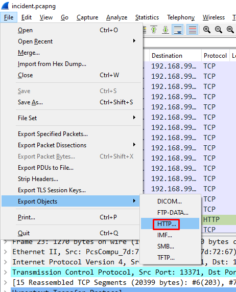
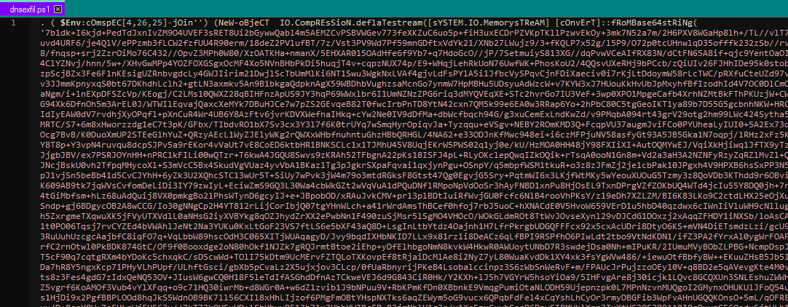
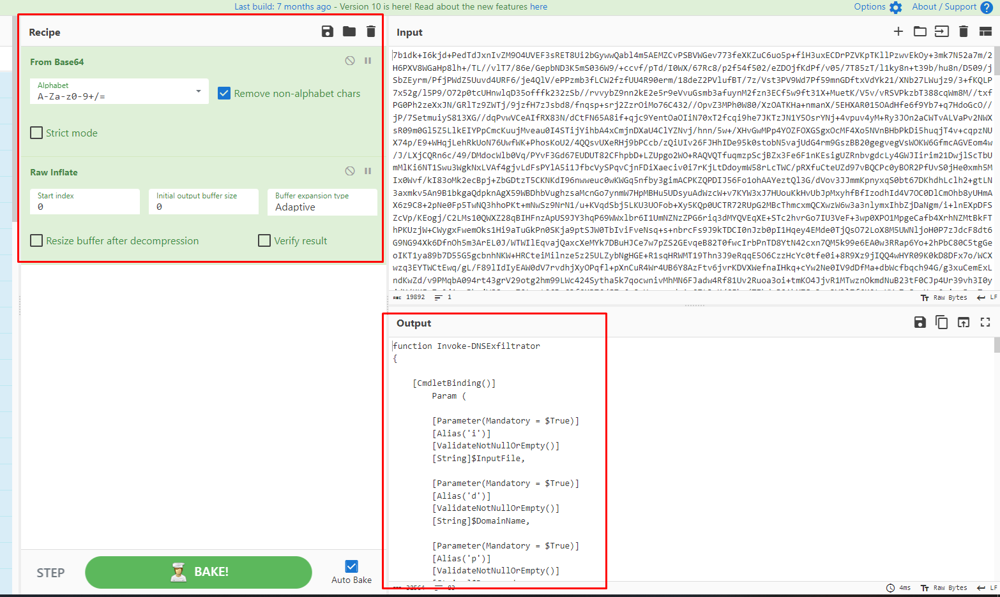
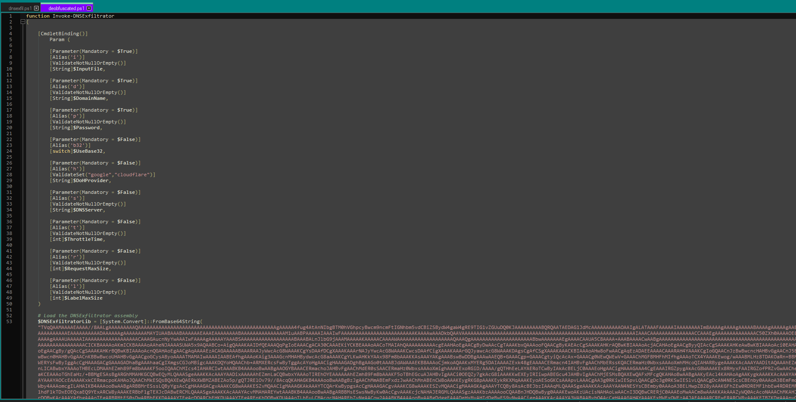
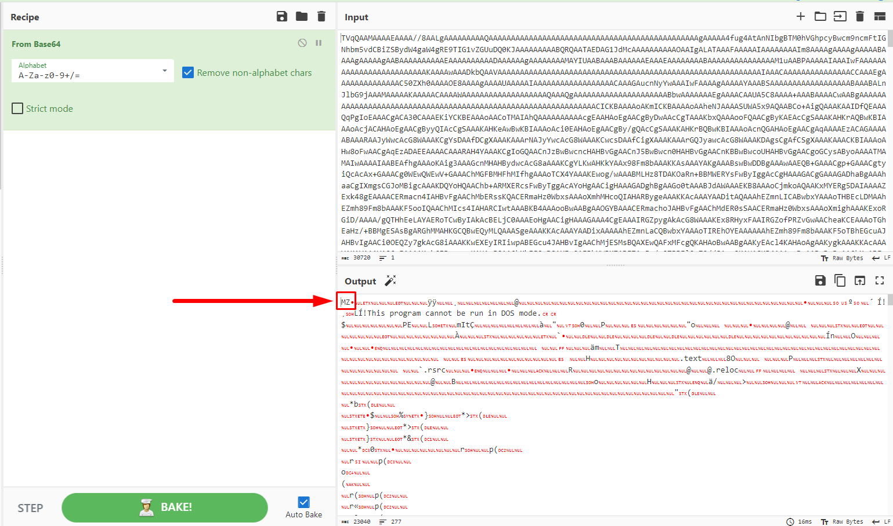
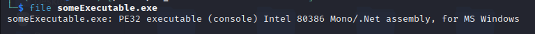
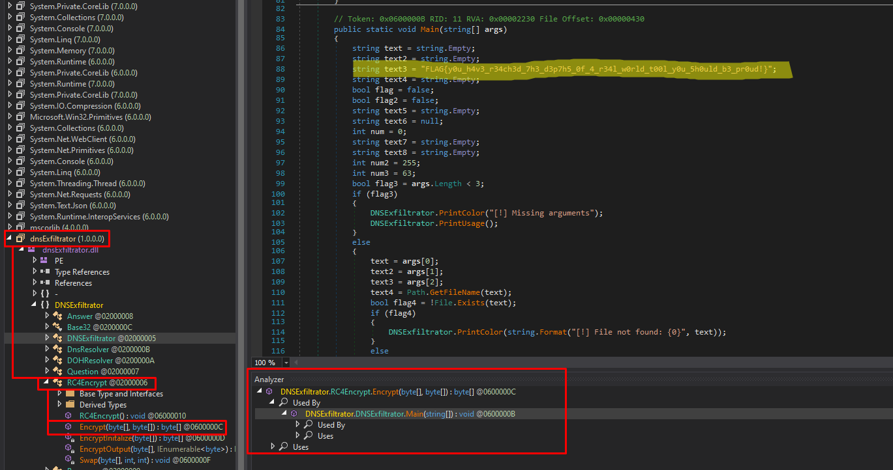

# Δοκιμασία 'showerpell'

| Δοκιμασία | showerpell |
| :------- | :----- |
| Δυσκολία | Δύσκολη |
| Κατηγορία | Ψηφιακή Εγκληματολογία |
| Λύσεις | 11 |
| Πόντοι | 475 |


## Περιγραφή Δοκιμασίας

``` 
Πρόσφατα είχαμε ένα περιστατικό ασφαλείας όπου ένα χρήστης εγκατέστησε κάτι κακόβουλο. Η ανάλυση του περιστατικού φαίνεται να μην τελειώνει αφού κάθε βήμα αποκαλύπτει ένα νέο στρώμα πολυπλοκότητας. 
```

## Επίλυση

Στην δοκιμασία αυτή δίνεται ένα pcap αρχείο. Παρατηρώντας τα πακέτα που υπάρχουν στο `pcap` εντοπίζεται ένα το οποίο φαίνεται να μεταφέρει ένα αρχείο με ονομασία "dnsexfil.ps1". 

Μέσω της επιλογής `File-->Export Objects-->HTTP` του Wireshark το αρχείο αυτό κατεβαίνει για την περαιτέρω ανάλυση του. 

Το πακέτο αυτό μπορούμε να το πάρουμε από το Wireshark για περαιτέρω ανάλυση πηγαίνοντας στο `File-->Export Objects-->HTTP`:



Μέσω ενός text editor το αρχείο αυτό ανοίγει και προβάλλονται τα περιεχόμενα του.



Το αρχείο φαίνεται να εμπεριέχει κώδικα σε κωδικοποιημένη μορφή. 

Παρατηρώντας τον κώδικα εντοπίζονται τα ακόλουθα σημαντικά στοιχεία: 
- Στο τέλος του αρχείου υπάρχει το `i'e'x` το οποίο είναι το τρόπος με τον οποίο εκτελεί το powershell εντολές. Αυτό υποδεικνύει πως με την εκτέλεση του κώδικα θα δημιουργηθεί ένα αρχείο που θα είναι εκτελέσιμο. 
- Το κακόβουλο πρόγραμμα που θα δημιουργηθεί φαίνεται πως κάνει αποκωδικοποίηση base64 ενός μεγάλου string. 
- Το αποτέλεσμα της αποκωδικοποίησης αποσυμπιέζεται με την μέθοδο `deflateStream`.


Ακολουθώντας τα βήματα αυτά είναι δυνατό να ανακτηθεί ο κώδικας που πρόκειται να εκτελεστεί. Για τον σκοπό αυτό χρησιμοποιείται το online εργαλείο CyberShef (https://gchq.github.io/CyberChef/). 



Το αποτέλεσμα πλέον βρίσκεται σε μία ευανάγνωστη μορφή και μπορεί να αποθηκευτεί σε ένα αρχείο `deobfuscated.ps1` για επιπλέον ανάλυση:



Ο κώδικας που προκύπτει φαίνεται να αποκωδικοποιεί από base64 και να αποθηκεύει σε μια μεταβλητή ένα μεγάλο string. Χρησιμοποιώντας πάλι το Cyberchef γίνεται η αποκωδικοποίηση του. 



Το αποτέλεσμα δεν είναι εξίσου ευανάγνωστο με τον προηγούμενο κώδικα ωστόσο, τα πρώτα 2 bytes του που είναι `MZ` αντιστοιχούν σε headers executable αρχείου, οπότε αποθηκεύεται σε ένα αρχείο τύπου `.exe`. 

Χρησιμοποιώντας την εντολή `file` ανακτώνται βασικές πληροφορίες για το εκτελέσιμο όπως το οτι είναι αρχείο `.NET`. 



Αφού το εκτελέσιμο είναι αρχείο `.NET` χρησιμοποιείται το εργαλείο DNSPY για να αναλυθεί ο κώδικας του. 



Παρατηρώντας τον κώδικα εντοπίζεται το flag της δοκιμασίας που ορίζεται ως μια μεταβλητή στην main function. 

`FLAG{y0u_h4v3_r34ch3d_7h3_d3p7h5_0f_4_r34l_w0rld_t00l_y0u_5h0uld_b3_pr0ud!}`

Στην δημιουργία αυτής της δοκιμασίας αξιοποιήθηκαν εργαλεία που χρησιμοποιούνται στον πραγματικό κόσμο από κακόβουλες οντότητες.

## Σημαία


```
FLAG{y0u_h4v3_r34ch3d_7h3_d3p7h5_0f_4_r34l_w0rld_t00l_y0u_5h0uld_b3_pr0ud!}
```