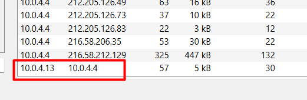
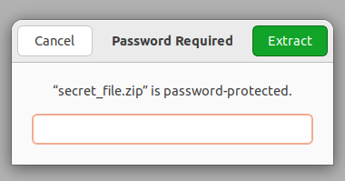

# Misleading Secret 

| Δοκιμασία | brokenSign |
| :------- | :----- |
| Δυσκολία | Πολύ Εύκολη |
| Κατηγορία |  Forensics |
| Λύσεις | 21 |
| Πόντοι | 100 |

## Περιγραφή Δοκιμασίας

``` 
Το πραγματικό μυστικό δεν είναι αυτό που φαίνεται.
```

## Επίλυση
Στην δοκιμασία αυτή παρέχεται ένα αρχείο `pcap` που εμπεριέχει ένα σημαντικό αριθμό πακέτων που μπορούν να αναλυθούν. Το εργαλείο που θα χρησιμοποιηθεί για την ανάλυση τους είναι το `Wireshark`. 


Το `Wireshark` επιτρέπει την διερεύνηση των πακέτων και των πεδίων τους αλλά επίσης παρέχει ορισμένα στατιστικά που δίνουν μια αρχική εικόνα για το σύνολο της δικτυακής κίνησης που υπάρχει στο pcap αρχείο. 

Τα στατιστικά που μελετώνται αρχικά είναι διαθέσιμα μέσω της επιλογής: `Statistics --> Conversations --> IPV4`. 


Μέσω της επιλογής αυτής παρατηρείται πως υπάρχει συνομιλία μεταξύ δύο IP διευθύνσεων του ίδιου δικτύου, οι οποίες είναι οι `10.0.4.4` και `10.0.4.13`. 



Παρατηρώντας τα πακέτα μεταξύ αυτών των 2 IP εντοπίζονται ορισμένα πακέτα που φαίνεται να αποτελούν μία συνομιλία. 


Κάνοντας δεξί κλικ στο πακέτο και επιλέγοντας `Follow --> TCP Stream` μπορούν να προβληθούν και τα υπόλοιπα πακέτα που είναι μέρος αυτής της συνομιλίας. 


Στην συνομιλία αυτή φαίνεται πως τα δύο μέρη συμφωνούν να ανταλλάξουν κάποιο μυστικό αρχείο μέσω του port 9002. 


Επομένως, στο φίλτρο του Wireshark χρησιμοποιείται το `tcp.post eq 9002` το οποίο προβάλλει τα πακέτα με port πηγής ή προορισμού το 9002. Άμεσα μπορεί να παρατηρηθεί η μεταφορά ενός αρχείου που ονομάζεται secret_file.zip 


Το αρχείο αυτό μπορεί να αποθηκευτεί μέσω της επιλογής `File --> Export Objects --> HTTP`.


Μετά την αποθήκευση του zip αρχείου παρατηρείται πως προκειμένου να προβληθούν τα περιεχόμενα του χρειάζεται έναν κωδικό. Επομένως, επιστρέφουμε στο `pcap` για την συλλογή περισσότερων πληροφοριών. 



Παρατηρώντας και τα επόμενα πακέτα που ανταλλάσσονται μεταξύ των δύο IP εντοπίζεται ακόμη μία ενδιαφέρουσα συνομιλία στην οποία φαίνεται να συμφωνούν στην ανταλλαγή του κωδικού του `secret_file.zip`.  


Η ανταλλαγή γίνεται μέσω του port `9002` και πάλι οπότε χρησιμοποιείται το αντίστοιχο φίλτρο. 


Οι IP ανταλλάσσουν ακόμη ένα αρχείο txt το οποίο αποθηκεύεται όπως και το `secret_file.zip`.


Πράγματι το αρχείο εμπεριέχει τον κωδικό για το secret_file.zip. 

Ανοίγοντας το `secret_file.zip` εντοπίζεται ένα αρχείο txt το οποίο εμπεριέχει ένα string που έχει την μορφή σημαίας αλλά δεν είναι αυτή η έγκυρη.  


Το string αυτό δίνει ως στοιχείο το ότι το flag έχει ήδη βρεθεί σε κάποιο προηγούμενο βήμα. 

Συγκεκριμένα, η ονομασία του αρχείου που εμπεριέχει τον κωδικό φαίνεται ενδιαφέρουσα καθώς μοιάζει να έχει κωδικοποιηθεί με base64. 


Χρησιμοποιώντας το Cyberchef (https://gchq.github.io/CyberChef/) γίνεται η αποκωδικοποίηση του και το αποτέλεσμα αρχίζει να μοιάζει με την μορφή που έχει η σημαία. 


Είναι γνωστό πως η μορφή της σημαίας είναι `FLAG{...}`, επομένως συγκρίνοντας το με το αποτέλεσμα της αποκωδικοποίησης παρατηρείται πως στην θέση του F υπάρχει του S, στην θέση του L υπάρχει το Y, στην θέση του A υπάρχει το N κτλ. 

Φαίνεται πως τα γράμματα έχουν αντικατασταθεί από τα γράμματα της αλφαβήτου που βρίσκονται `13` θέσεις μπροστά.  


Αυτή η κρυπτογράφηση ονομάζεται `ROT13`. Χρησιμοποιώντας και πάλι το CyberChef με την λειτουργεία `ROT13` ανακτάται το αρχικό flag. 


## Σημαία

```
FLAG{h1dd3n_1n_pla1n_sight}
```