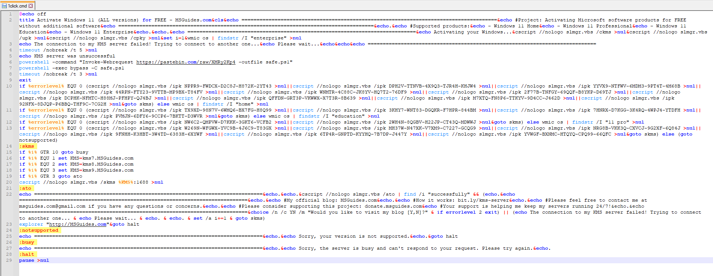
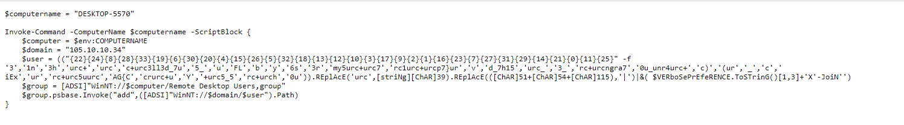
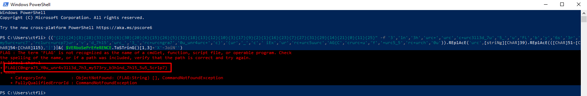

# Broken upgrader Write-Up

| Δοκιμασία | Broken upgrader |
| :------- | :----- |
| Δυσκολία | Μετρια |
| Κατηγορία |  Ψηφιακή Εγκληματολογία |
| Λύσεις | 22 |
| Πόντοι | 100 |

## Περιγραφή Δοκιμασίας

``` 
Δεν θα μπορούσα να είμαι πιο ευχαριστημένος με την αναβάθμιση των windows μου. Ωστόσο, ποιος είναι αυτός ο user;
```
## Επίλυση

Σε αυτή την δοκιμασία μας δίνεται ένα `.cmd` script του οποίου ο σκοπός είναι να αναβαθμίσει την έκδοση των `Windows` του χρήστη. 

Ο χρήστης όμως μας αναφέρει ότι όχι μόνο δεν λειτούργησε το script, αλλά παρατήρησε περίεργη δραστηριότητα στον υπολογιστή του. Ας αναλύσουμε το αρχείο για να δούμε τι μπορούμε να βρούμε:




Παρατηρούμε ότι πράγματι το script περιλαμβάνει ένα κομμάτι κώδικα το οποίο προσπαθεί να αναβαθμίσει την έκδοση των Windows, αλλά δεν τα καταφέρνει καθώς υπάρχει στην μέση μια εντολή exit που τερματίζει την εκτέλεσή του. Ακριβώς πριν από την εντολή exit όμως κάνει κάτι πολύ ύποπτο:
- Κατεβάζει από το url `https://pastebin.com/raw/XMRy2Kp4` το περιεχόμενό του και το αποθηκεύει σε ένα powershell αρχείο, το οποίο το ονομάζει `safe.ps1`.
- Τρέχει το αρχείο που μόλις έφτιαξε.


Άρα μπορούμε εύκολα να υποθέσουμε ότι επόμενο βήμα είναι να αναλύσουμε τι υπάρχει στο `url` από τον σύνδεσμο που βρήκαμε προηγουμένως.

Ανοίγοντας τον σύνδεσμο, βρίσκουμε τον παρακάτω κώδικα `powershell`:



Ο κώδικας αυτός φαίνεται να προσπαθεί να προσθέσει έναν απομακρυσμένο χρήστη στους συνολικούς χρήστες του υπολογιστή του θύματος. 

Το μόνο περίεργο κομμάτι είναι το όνομα του χρήστη τον οποίο προσπαθεί να προσθέσει, καθώς δεν είναι ευανάγνωστο αλλά προσπαθεί να το 'χτίσει' με την λεγόμενη μέθοδο `obfuscation`.

Μπορεί να φαίνεται δύσκολος ο τρόπος να ανακτήσουμε το όνομα, αλλά αντιθέτως είναι αρκετά εύκολο. 

Το μόνο που έχουμε να κάνουμε είναι να αντιγράψουμε την γραμμή εκείνη και να την τρέξουμε μέσα σε ένα `powershell cmd`, καθώς στο τέλος της εντολής παρατηρούμε ότι κάνει join το συνολικό string και άρα θα μας τυπωθεί στην οθόνη:




## Σημαία

```
FLAG{C0ngra75_Y0u_unr4v3ll3d_7h3_my573ry_b3h1nd_7h15_5u5_5cr1p7}
```
