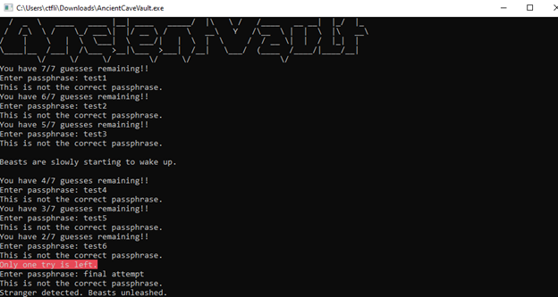
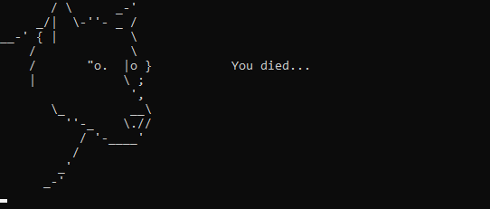
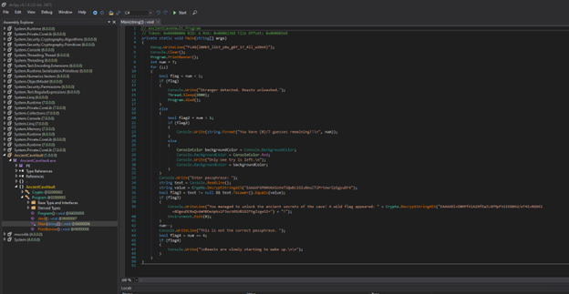
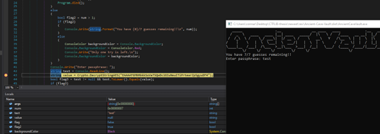
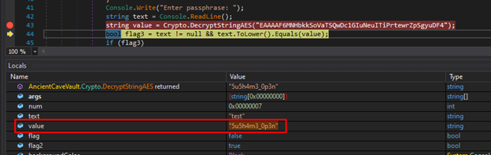
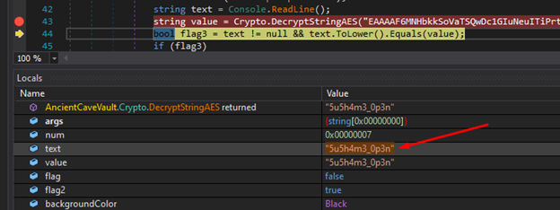
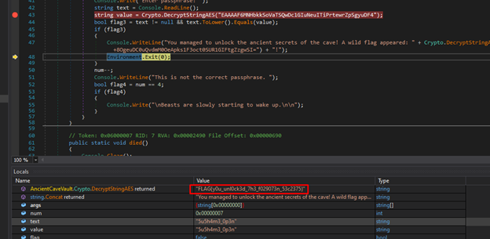

# Ancient-Cave-Vault Write-Up


| Δοκιμασία | Ancient-Cave-Vault |
| :------- | :----- |
| Δυσκολία | Μέτρια |
| Κατηγορία |  Αντίστροφη Μηχανική (Reverse Engineering) / Κρυπτογραφία (Cryptography)|
| Λύσεις | 21 |
| Πόντοι | 100 |


## Περιγραφή Δοκιμασίας

``` 
In the heart of a forbidding cave, an intrepid explorer ventured through the oppressive darkness, shadows dancing at the edge of her lantern's light. She stumbled upon an enigmatic ancient vault, its entrance adorned with cryptic symbols. Determined, she desperately tries to find the correct passphrase that will unlock the secrets within. But her time is running low and the beasts of the cave are starting to wake up. Can you help her?
```


## Επίλυση

Σε αυτή την δοκιμασία μας δίνεται ένα εκτελέσιμο αρχείο το οποίο μας ζητάει να εισάγουμε έναν κωδικό για να αποκτήσουμε πρόσβαση. Επομένως θα χρειαστεί να αναλύσουμε το εκτελέσιμο αρχείο με αντίστροφη μηχανική για να βρούμε τον κωδικό.



Μετά από ορισμένες λάθος προσπάθειες το εκτελέσιμο αρχείο σταματάει.



Αν εκτελέσουμε την εντολή `file` θα δούμε ότι πρόκειται για ένα εκτελέσιμο αρχείο .NET οπότε θα χρησιμοποιήσουμε το εργαλείο dnspy για να το αναλύσουμε.
Ανοίγουμε το dnspy λοιπόν και κάνουμε import το `.exe`



Υπάρχουν πολλές προσεγγίσεις που μπορούμε να ακολουθήσουμε για να βρούμε τον κωδικό. Ο πιο απλός είναι να βάλουμε ένα breakpoint στην γραμμή που ελέγχει την τιμή που δίνουμε ως κωδικό με τον αποκρυπτογραφημένο κωδικό



προχωρώντας μια γραμμή μετά το `breakpoint`, θα δούμε ότι η μεταβλητή "price" διατηρεί τώρα την αποκρυπτογραφημένη φράση πρόσβασης:



Έχοντας τον σωστό κωδικό μπορούμε να αλλάξουμε την αρχική τιμή που δώσαμε σαν κωδικό στην αναμενόμενη τιμή:



Προχωρώντας ακόμα μια γραμμή ξανά `step`, περνάμε το `if statement` και παίρνουμε το flag



## Σημαία


```
FLAG{y0u_unl0ck3d_7h3_f029073n_53c2375}
```
