# RAND0MWARE Write-Up


| Δοκιμασία | RAND0MWARE |
| :------- | :----- |
| Δυσκολία | Δύσκολη |
| Κατηγορία |  Αντίστροφη Μηχανική (Reverse Engineering) / Προγραμματισμός (Programming) / Κρυπτογραφία (Cryptography)|
| Λύσεις | 3 |
| Πόντοι | 595 |


## Περιγραφή Δοκιμασίας

``` 
"Τα ισχυρά πιστοποιητικά κρυπτογραφήθηκαν από ένα ransomware...Ο Jack Nelson μαζί με τους Ιταλούς πρέπει να  βρίσκονται πίσω από αυτή την επίθεση. Και όλη αυτή η φασαρία για κάποια ανόητη γραμμή που υποτίθεται ότι έχω περάσει. Μπορείς να βοηθήσεις? Αυτό είναι πιστοποιητικό που χρησιμοποιήθηκε στο ransomware."
```


## Επίλυση
### Με μια πρώτη ματιά

Σε αυτό το challenge μας δίνονται 15 αρχεία:

1. `Alfie_Solomons.pdf` : Πρόκειται για το certificate που χρησιμοποιήθηκε στο ransomware.
2. `*encrypted_1.enc` : Η κρυπτογραφημένη έκδοση του Alfie_Solomons.pdf.
3. `*encrypted_2.enc` : Η κρυπτογραφημένη έκδοση κάποιου άλλου πιστοποιητικού.
4. `RAND0MWARE.exe` : Το εκτελέσιμο αρχείο.

Εκτελώντας το εκτελέσιμο αρχείο (Σε κάποιο vm για να μην μας κρυπτογραφήσει τα αρχεία) παρατηρούμε το εξής :

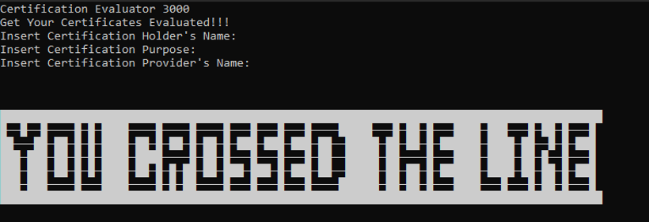

Επομένως ζητάει κάποια `inputs` από τον χρήστη και στην συνέχεια κάνει `encrypt` τα αρχεία του.

Εκτελόντας την εντολή : `file RAND0MWARE.exe` παρατηρούμε ότι πρόκειται για `.NET` εκτελέσιμο αρχείο. Αυτό σημαίνει ότι μπορούμε να το κάνουμε `decompile` με εργαλεία τύπου `DNSPY`.

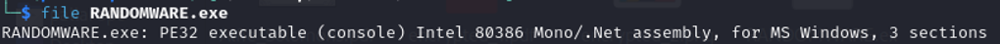

### Ανάλυση Πηγαίου Κώδικα

Ανοίγουμε το πρόγραμμα στο `dnspy` και μεταφερόμαστε κατευθείαν στην `main` συνάρτηση. Εκεί βλέπουμε τα μηνύματα που είδαμε όταν τρέξαμε το πρόγραμμα. 

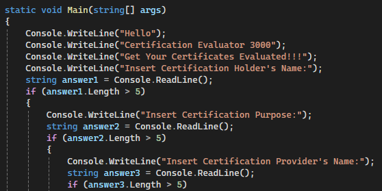

Επιπλέον παρατηρούμε δύο στατικές μεταβλητές

`a =  Sup3r_S3cur3_Rand0m_` και `b = s33d_f0r_4_R4ns0m`

Και 3 ακόμα μεταβλητές που αρχικοποιούνται απο μια συνάρτηση GenerateRandomBytes.

`byte[] c = GenerateRandomBytes(2);`, `byte[] key = GenerateRandomBytes(16);` και `byte[] iv = GenerateRandomBytes(12);`

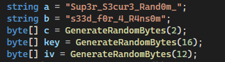

Η συνάρτηση `GenerateRandomBytes()` είναι η παρακάτω :

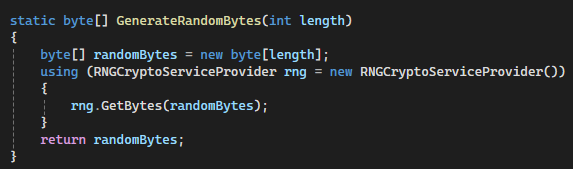

χρησιμοποιείται για να παράγει `χ` αριθμό τυχαίων bytes.

Έχοντας αρχικοποιήσει 5 μεταβλητές το πρόγραμμα δημιουργεί ένα αντικείμενο της κρυπτογραφικής συνάρτησης κατακερματισμού (hash function) `md5` με την οποία :

1. Υπολογίζει το `hash` της συνένωσης των μεταβλητών `a + b + c` και το αποθηκεύει σε μια μεταβλητή `key2`.
2. Υπολογίζει  το hash της συνένωσης των μεταβλητών `seed1 + seed2 + seed3` και το αποθηκεύει σε μια μεταβλητή key3.

Οι μεταβλητές `seed1,seed2,seed3` είναι ένα μέρος των απαντήσεων που δόθηκαν κατά την εκτέλεση του προγράμματος.

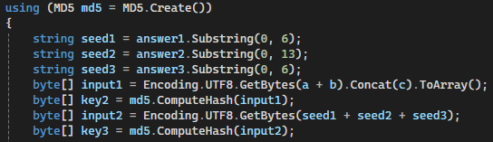

Στην συνέχεια το πρόγραμμα ψάχνει στο directory που έχει εκτελεστεί για αρχεία pdf,txt και png.
Για κάθε αρχείο που βρήκε κάνει τα ακόλουθα:

1. Διαβάζει τα raw bytes του και τα περνάει στην συνάρτηση `Weird_ECB` μαζί με τις μεταβλητές `key (16 bytes)`, `iv (12 bytes)`.
2. Το αποτέλεσμα της `Weird_ECB` περνάει στην συνάρτηση `ECB` μαζί με την παράμετρο `key2 (md5 hash == 16 bytes)`.
3. Το αποτέλεσμα της `ECB` περνάει στην για ακόμα μια φορά στην `ECB` αυτή την φορά με την παράμετρο `key3 (md5 hash == 16 bytes)`.
4. Το τελικό αποτέλεσμα μετατρέπεται σε δεκαεξαδική αναπαράσταση και αποθηκεύεται σαν αρχείο.

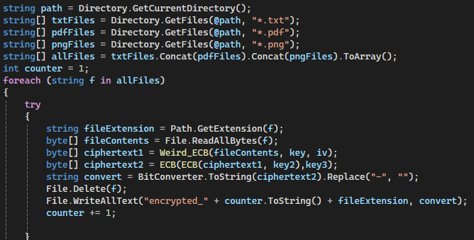

Η συνάρτηση `ECB` παρατηρούμε ότι είναι μια κανονική υλοποίηση του `Electronic Code Book` του κρυπτογραφικού αλγορίθμου `AES`.

1. ` key size = 128 bits === 16 bytes`

2. `block size = 128 bits === 16 bytes`

3. `padding PKCS7`

4. `Κρυπτογράφιση του plaintext`


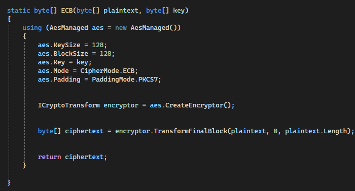

Η συνάρτηση `Weird_ECB` παρατηρούμε ότι στην αρχή μοιάζει με την υλοποίηση `ECB` ωστόσο διαφοροποιείται στην συνέχεια.

1. `key size = 128 bits === 16 bytes`

2. `block size = 128 bits === 16 bytes`

3. `padding = κανένα`

4. Βάση του μεγέθους του `Plaintext` και του μεγέθους ενός block υπολογίζει πόσα block θα χρειαστούν για το ciphertext και δημιουργεί έναν byte string μεγέθους τόσων block.

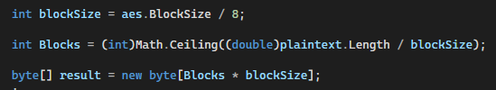

5. Ξεκινάει μια επανάληψη με μετρητή το i για κάθε block.

6. Παίρνει την μεταβλητή `nonce (12 bytes)` η οποία έχει δοθεί ως όρισμα και την αποθηκεύει σε μια άλλη μεταβλητή `iv μεγέθους 16 bytes`. 

Στην συνέχεια προσθέτει την εκάστοτε τιμή του i σαν little endian bytestring
   μεγέθους 4. Δηλαδή στην πρώτη επανάληψη το i θα είναι `\x01\x00’x00\x00` , στην δεύτερη `\x02\x00’x00\x00` ...
   
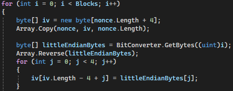

7. Κρυπτογραφεί την μεταβλητή `iv (16 bytes)` με ECB και στην συνέχεια το αποτέλεσμα γίνεται `xor` με το αντίστοιχο `plaintext block`.

8. Μόλις κρυπτογραφηθούν όλα τα blocks επιστρέφει το `κρυπτοκείμενο`.

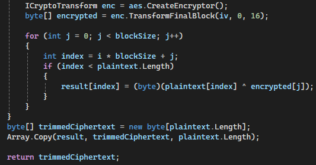

Με λίγες γνώσεις στην κρυπτογραφία μπορούμε να καταλάβουμε ότι η παραπάνω συνάρτηση δεν κάνει τίποτα παραπάνω από `AES CTR` κρυπτογράφηση.

1. `Παίρνει ένα iv (12 bytes)`.
2. `Προσθέτει έναν μετρητή 4 (bytes)`.
3. `Τον κάνει encrypt με τον αλγόριθμο AES`
4. `Κάνει xor το αποτέλεσμα με το Plaitext`

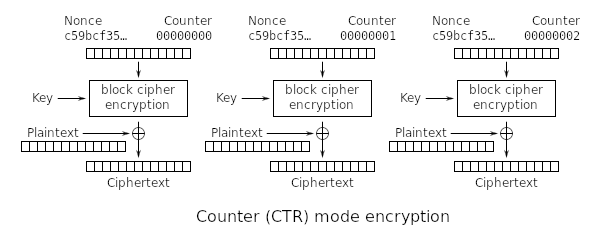

### Ανάλυση - Εύρεση ευπάθειας - Exploitation

Πρώτα απ’ όλα  γνωρίζουμε ποιο αρχείο χρησιμοποιήθηκε στο πρόγραμμα. 


Επομένως, μπορούμε να κάνουμε recreate της απαντήσεις και να κρατήσουμε τα μέρη των απαντήσεων που κράτησε το πρόγραμμα από το αρχείο `Alfie_Solomons.pdf`.

- Input1 = Alfie Solomons
- Input2 = Professional Rum Producer
- Input3 = Shelby Company Limited

Άρα μπορούμε να υπολογίσουμε το `key3` ως 

`md5(Input1[:6] + Input2[:13]  + input3[:6]) == md5('Alfie Professional Shelby')`

Επιπλέον μπορούμε να υπολογίσουμε το key2.

Γνωρίζουμε ότι `key = md5(a+b+c)`, όπου `a =  Sup3r_S3cur3_Rand0m_`, `b = s33d_f0r_4_R4ns0m` και `c = 2 τυχαία bytes`.

Για 2 τυχαία bytes υπάρχουν `256*256 = 65536` πιθανοί συνδιασμοί, αρκετά μικρό για να το κάνουμε `bruteforce` και να υπολογίσουμε το `key2`.

Ωστόσο, αυτό θα απαιτούσε να γνωρίζουμε το `key` και το `iv` για να ελέγχουμε αν το κάθε κλειδί αποκρυπτογραφούσε σωστά το κείμενο. 

Υπάρχει άλλος τρόπος να το καταφέρουμε αυτό όμως.

Αν παρατηρήσουμε θα δούμε ότι το ίδιο `key` και το ίδιο `iv` χρησιμοποιούνται για την κρυπτογράφηση κάθε αρχείου. 

Όπως γνωρίζουμε ο CTR είναι vulnerable όταν χρησιμοποιεί το ίδιο ζευγάρι κλειδιού-nonce.

Αυτό συμβαίνει γιατί κάθε φορά παράγεται και γίνεται xor το ίδιο keystream. 

Επομένως, κάποιος γνωρίζοντας ένα `plaintext`, το `ciphertext` του και ένα ακόμα `ciphertext2` μπορεί να αποκρυπτογραφήσει το `ciphertext2`. 

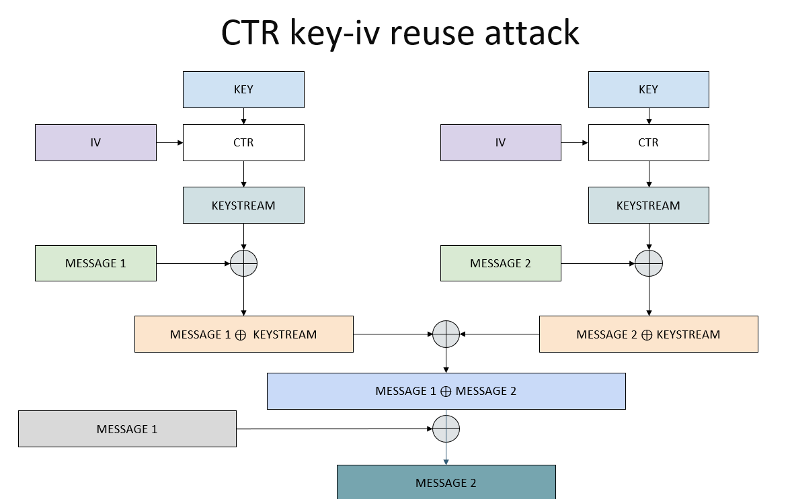

Εμείς διαθέτουμε ένα `pdf` αρχείο, την `κρυπτογραφημένη έκδοση` του και μια `κρυπτογραφημένη φωτογραφία png`.

Άρα μπορούμε να :

1. Κάνουμε decrypt το κρυπτοκείμενο χρησιμοποιώντας ECB με το κλειδί `md5('Alfie Professional Shelby')`.

2. Να αφαιρέσουμε το `padding` της πρώτης κρυπτογράφησης και σε μια επανάληψη μέχρι το `65536` να προσπαθούμε να ανακτήσουμε το `key` = `md5(Sup3r_S3cur3_Rand0m_s33d_f0r_4_R4ns0m + 2random_bytes)`
3. Για κάθε πιθανό decrypt να αφαιρούμε ξανά το padding του δεύτερου encryption και να εκτελούμε την επίθεση στο `CTR`.
4. Δηλαδή θα κάνουμε `xor` το κάθε αποκρυπτογραφημένο κείμενο με το `pdf` που γνωρίζουμε και το `ciphertext` του.

Επειδή προσπαθούμε να αποκρυπτογραφήσουμε μια `png` φωτογραφία μπορούμε να ελέγχουμε αν το τελικό κείμενο ξεκινάει με `\x89PNG` που αποτελεί τον header για κάθε `png` φωτογραφία.

Αν ξεκινάει με αυτόν τον header σημαίνει ότι έχουμε αποκρυπτογραφήσει την φωτογραφία.

### Solver


```py
import itertools
from hashlib import md5
from Crypto.Util.Padding import unpad
from Crypto.Cipher import AES
import itertools

def bxor(a, b): # byte xor
    return bytes(x ^ y for x, y in zip(a, b))

with open("encrypted_1.pdf","r") as f: # encrypted 1
    PDF_ENC = bytes.fromhex(f.read())

with open("encrypted_2.png","r") as f: # encrypted 3
    PNG_ENC = bytes.fromhex(f.read())

with open("Alfie_Solomons.pdf","rb") as f: # known plaintext
    known = f.read()

a = b"Sup3r_S3cur3_Rand0m_" # static value2
b = b"s33d_f0r_4_R4ns0m" # static value1

answer1 = b"Alfie Solomons" # answer1
answer2 = b"Professional Rum Producer" # answer2
answer3 = b"Shelby Company Limited" # answer3

byte_combinations = list(itertools.product(range(256), repeat=2))
i = 1
for c in byte_combinations:
    print(f"Try {i} remaining {256*256 - i}")
    i += 1
    key2 = md5( a + b + bytes(c) ).digest() # Create possible Key2
    key3 = md5( answer1[:6] + answer2[:13] + answer3[:6] ).digest() # Create Key3
    try:
        ECB_1 = AES.new(key2,AES.MODE_ECB) # Create AES ECB Object with key2
        ECB_2 = AES.new(key3,AES.MODE_ECB) # Create AES ECB Object with key3
        
        CTR_ENCRYPTED_PDF = unpad(ECB_1.decrypt(unpad(ECB_2.decrypt(PDF_ENC),16)),16)
        # Decrypt with ECB key3 -> unpad -> Decrypt with ECB key2
        CTR_ENCRYPTED_PNG = unpad(ECB_1.decrypt(unpad(ECB_2.decrypt(PNG_ENC),16)),16)
        # Decrypt with ECB key3 -> unpad -> Decrypt with ECB key2
        key_stream = bxor(CTR_ENCRYPTED_PDF,CTR_ENCRYPTED_PNG)
        # XOR the CTR outputs
        recovered = bxor(key_stream,known)
        # XOR with known plaintext (pdf)
        # Check if its a PNG via the Header
        if recovered.hex().startswith("89504e470d0a1a0a"): 
            with open("recover.png","wb") as r:
                r.write(recovered) # Re-create the file
                print(f"Random Bytes were {  bytes(c) }")
                break
    except:
        continue

```

## Σημαία

Μπορούμε να ανοίξουμε την εικόνα `recovered.png` και να πάρουμε το flag.

```
FLAG{br34k1ng_thr0ugh_th3_b4rr13r_0f_rand0mn355!!!}
```
