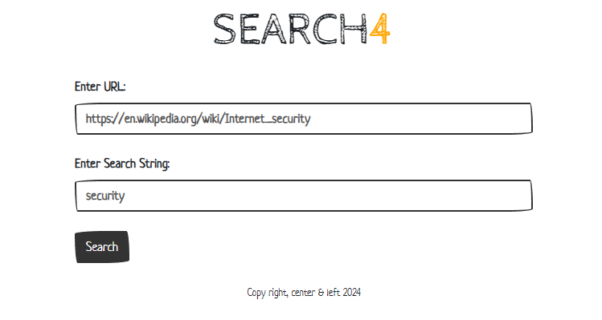
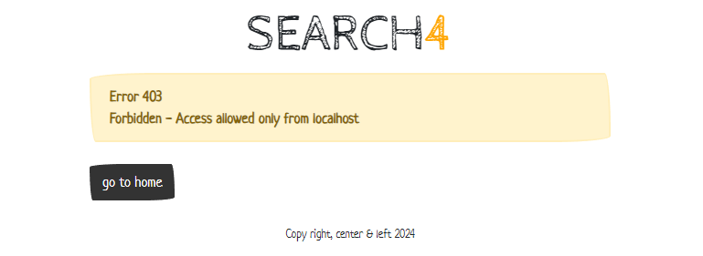
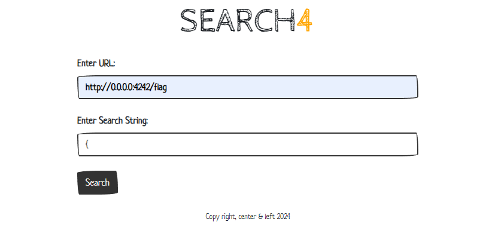
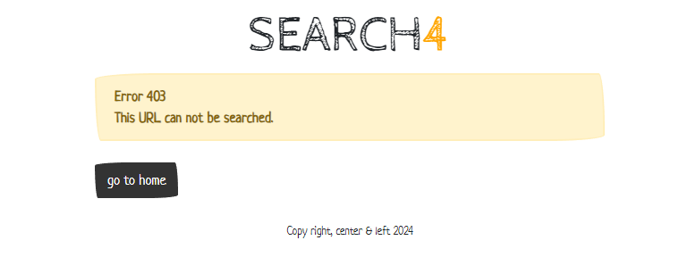
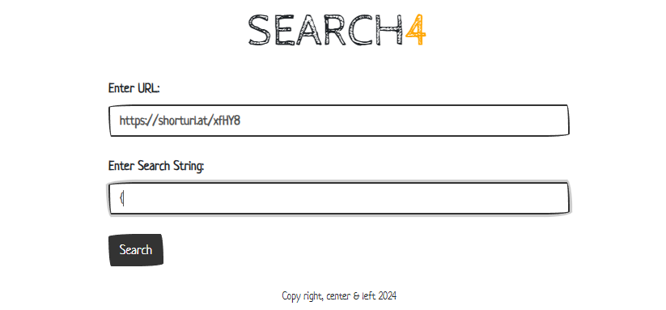
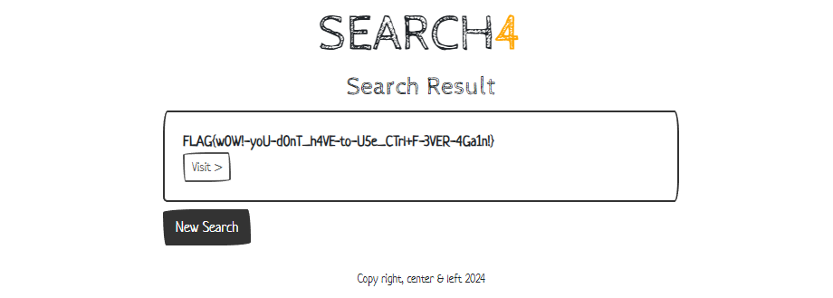

# Search 4 Write-Up

| Δοκιμασία | Search 4         |
| :-------- | :--------------- |
| Δυσκολία  | Εύκολη           |
| Κατηγορία | Παγκόσμιος Ιστός |
| Λύσεις    | 8                |
| Πόντοι    | 539              |

## Περιγραφή Δοκιμασίας

Η δοκιμασία αναφέρει:
``` 
Ανέπτυξα μια απλή εφαρμογή την οποία μπορείτε να χρησιμοποιήσετε όταν το CTRL+F σας δεν λειτουργεί.
```

Παράλληλα μας δίνεται και ένα αρχείο zip με τον κώδικα της διαδικτυακής εφαρμογής.

## Ανάλυση Δοκιμασίας

Ο κώδικας της ιστοσελίδας είναι γραμμένος στην γλώσσα Ruby το οποίο φαίνεται και από το συντακτικό της, αλλά και από την επέκταση `.rb` του αρχείου `app.rb`.

Η εφαρμογή μας αφήνει να κάνουμε αναζήτηση σε μια ιστοσελίδα της επιλογής μας:


Και μας εμφανίζει τα αποτελέσματα:


Αναλύοντας τον κώδικα της εφαρμογής, βλέπουμε πως η σημαία της δοκιμασίας μπορεί δοθεί αν επισκεφτούμε τον σύνδεσμο `/flag`:
```ruby
get '/flag' do
	@result = File.read('flag.txt').strip rescue 'CTFLIB{example-flag}'
	erb :result
end
```

Αλλά είναι προσβάσιμος μόνο αν ο επισκέπτης έχει τοπική IP:
```ruby
before '/flag' do
	puts "request.ip = #{request.ip}"
	halt 403, "Forbidden - Access allowed only from localhost" unless is_localhost_ip?(request.ip)
end

def is_localhost_ip?(ip)
	localhost_addresses = ['0.0.0.0', '127.0.0.1', '::1', '::ffff:127.0.0.1']
	localhost_addresses.include?(ip)
end
```



Για να μπορέσουμε να πάρουμε τις πληροφορίες από τον σύνδεσμο `/flag` μπορούμε να χρησιμοποιήσουμε την αναζήτηση του εργαλείου για να τον φορτώσει για εμάς. Αλλά ούτε αυτό είναι τόσο απλό, μιας και δεν μας αφήνει να κάνουμε αναζήτηση σε URLs της ίδιας της ιστοσελίδας:

```ruby
post '/search' do
	@url = params[:url]
	@search_string = params[:search_string]

	if is_localhost_url?(@url)
		halt 403, "This URL can not be searched."
	elsif @url && @search_string
		@result = search_website(@url, @search_string)
	else
		halt 500, "Invalid search query."
	end

	erb :result
end
```




## Επίλυση

Για να μπορέσουμε να παρακάμψουμε τους μηχανισμούς της σελίδας και να ανακτήσουμε την σημαία, μπορούμε να χρησιμοποιήσουμε κάποιον μηχανισμό ανακατεύθυνσης του αιτήματος προς την σελίδα που έχει την σημαία. Για παράδειγμα, μπορούμε να κάνουμε χρήση κάποια υπηρεσίας URL shortner (όπως η https://www.shorturl.at/) για να περάσουμε τον έλεγχο και να γίνει η αναζήτηση:






## Σημαία

Και να ανακτήσουμε έτσι την σημαία:
```
FLAG{w0W!-yoU-d0nT_h4VE-to-U5e_CTrl+F-3VER-4Ga1n!}
```
