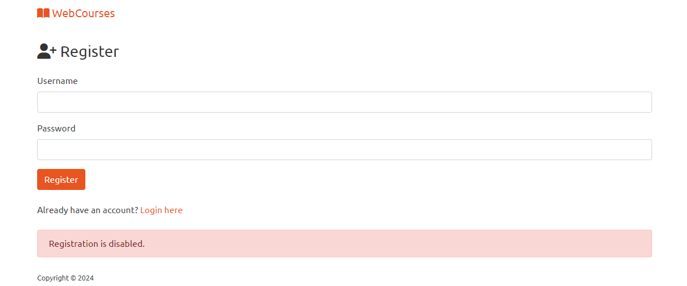
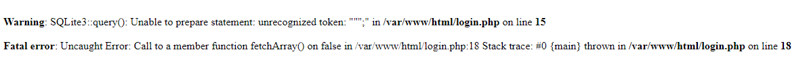
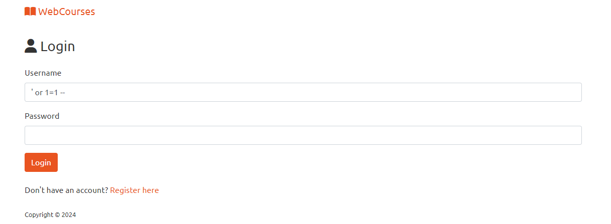
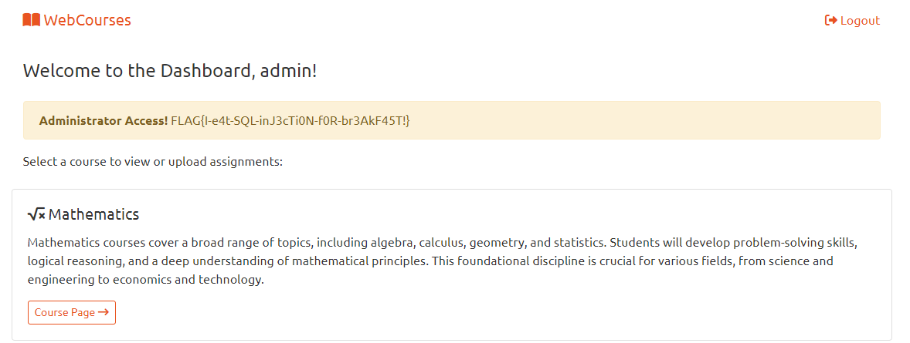

# WebCourses Write-Up

| Δοκιμασία | WebCourses       |
| :-------- | :--------------- |
| Δυσκολία  | Εύκολη           |
| Κατηγορία | Παγκόσμιος Ιστός |
| Λύσεις    | 30               |
| Πόντοι    | 100              |

## Περιγραφή Δοκιμασίας

```
Το σχολείο μας φτιάχνει μια διαδικτυακή εφαρμογή για να ανεβάζουν καθηγητές και μαθητές υλικό για τα μαθήματα σε ψηφιακή μορφή. Δεδομένου ότι ο ιστότοπος είναι ακόμα υπό κατασκευή, μας ανατέθηκε η διενέργεια δοκιμών για τυχόν προβλήματα ασφαλείας.
```


## Ανάλυση Δοκιμασίας

Ανοίγοντας τον ιστότοπο μας ζητείτε ένα username και ένας κωδικός πρόσβασης


ενώ παράλληλα υπάρχει και μια φόρμα για την δημιουργία λογαριασμού, της οποίας όμως η λειτουργία είναι απενεργοποιημένη:


Τα δεδομένα τα οποία έχουμε, φαίνεται πως πρέπει να βρούμε ένα τρόπο να συνδεθούμε παρακάμπτοντας ίσως την αυθεντικοποίηση του χρήστη.


## Επίλυση

Ξεκινάμε να δοκιμάζουμε τρόπους για να συνδεθούμε. Αρχικά δοκιμάζουμε μερικά συχνά default διαπιστευτήρια, όπως username `admin` και κωδικό πάλι `admin`, χωρίς επιτυχία.

Στην συνέχεια εξετάζουμε την ύπαρξη τυχών SQL injection βάζοντας σε κάποιο από τα πεδία quotes τα οποία αν υπάρχει η εν λόγο ευπάθεια, μπορούν να παράγουν ένα σφάλμα στον διακομιστή.

Δοκιμάζουμε με username `"'` και κωδικό `"'` το οποίο παράγει το σφάλμα που περιμέναμε και επιβεβαιώνει την ύπαρξη SQL injection και μάλιστα μας ενημερώνει πως ο διακομιστής χρησιμοποιεί SQLite3:


Για την εκμετάλλευση της ευπάθειας αυτής δοκιμάζουμε κλασικά SQL injection payloads (για SQLite3) όπως τα `" or 1=1 --` και `' or 1=1 --`. Από τα 2 payloads το 2ο θα δουλέψει και θα καταφέρουμε να συνδεθούμε στην εφαρμογή:






## Σημαία

```
FLAG{I-e4t-SQL-inJ3cTi0N-f0R-br3AkF45T!}
```
