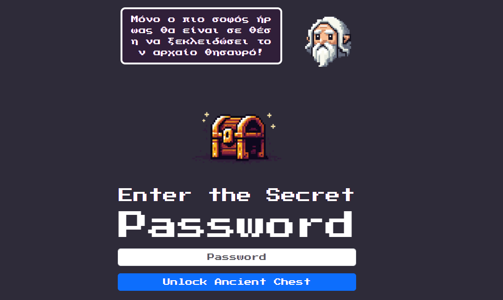
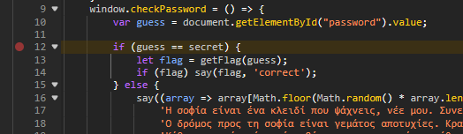
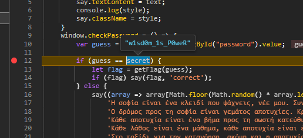

# Client Chest

| Δοκιμασία | Client Chest |
| :------- | :----- |
| Δυσκολία | Εύκολη |
| Κατηγορία | web |
| Λύσεις | 30 |
| Πόντοι | 100 |



Μας δίνεται μια ιστοσελίδα στην οποία πρέπει να βρούμε ένα κωδικό για να ξεκλειδώσουμε το flag.

## Επίλυση

Ανοίγουμε τον κώδικα της σελίδας και βρίσκουμε το σημείο που γίνεται η σύγκριση του κωδικού:
```javascript
	window.checkPassword = () => {
		var guess = document.getElementById("password").value;

		if (guess == secret) {
			let flag = getFlag(guess);
			if (flag) say(flag, 'correct');
		} else {
			...
		}
	}
```

Ο κωδικός που εισάγουμε συγκρίνετε με την μεταβλητή `secret`.

Με την χρήση των εργαλείων προγραμματιστή (Ctrl+Shift+J) του περιηγητή μας πάμε στο σημείο αυτό του κώδικα (κάτω από την καρτέλα Sources) και βάζουμε ένα breakpoint.


Στην συνέχεια πάμε και βάζουμε ένα τυχαίο κωδικό και πατάμε "Unlock Ancient Chest". Ο περιηγητής θα παγώσει και πηγαίνοντας το ποντίκι μας πάνω από τις μεταβλητές στο σημείο του κώδικα που είμαστε θα μπορέσουμε να δούμε την τιμή τους.


Βλέπουμε πως η μεταβλητή `secret` έχει την τιμή `w1sd0m_1s_P0weR`.

Πατάμε συνέχεις και βγάζουμε το breakpoint από τον κώδικα.
Στην συνέχεια βάζουμε για κωδικό `w1sd0m_1s_P0weR` και πατάμε "Unlock Ancient Chest" και εκτυπώνετε το flag στο πάνω μέρος της οθόνης μας.


## Σημαία

```
FLAG{d3v-t00l5-pr0-oR-JS-h4cKeR?}
```
